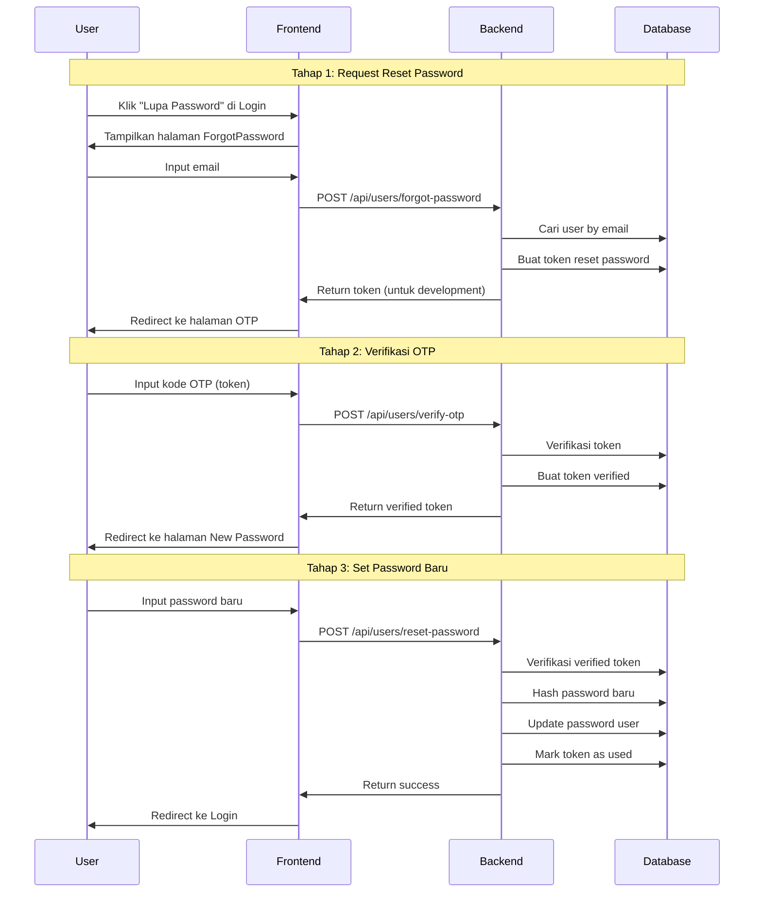
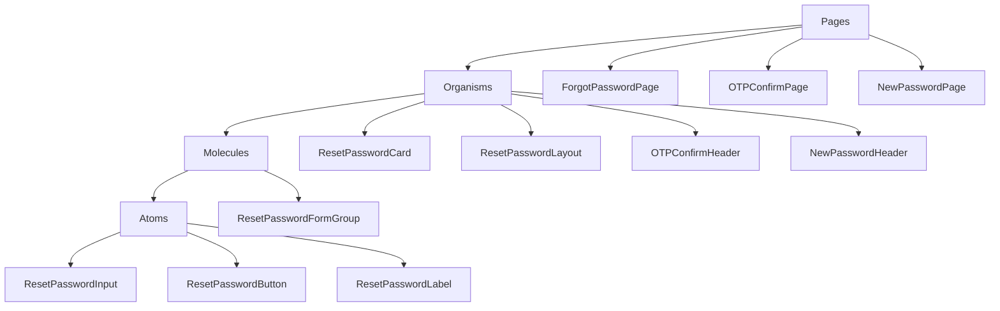
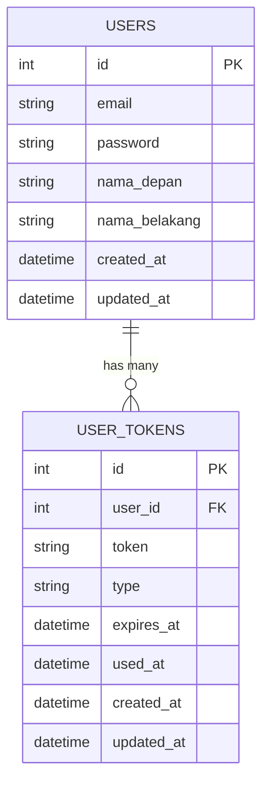
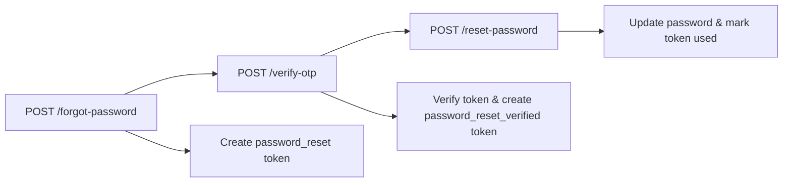
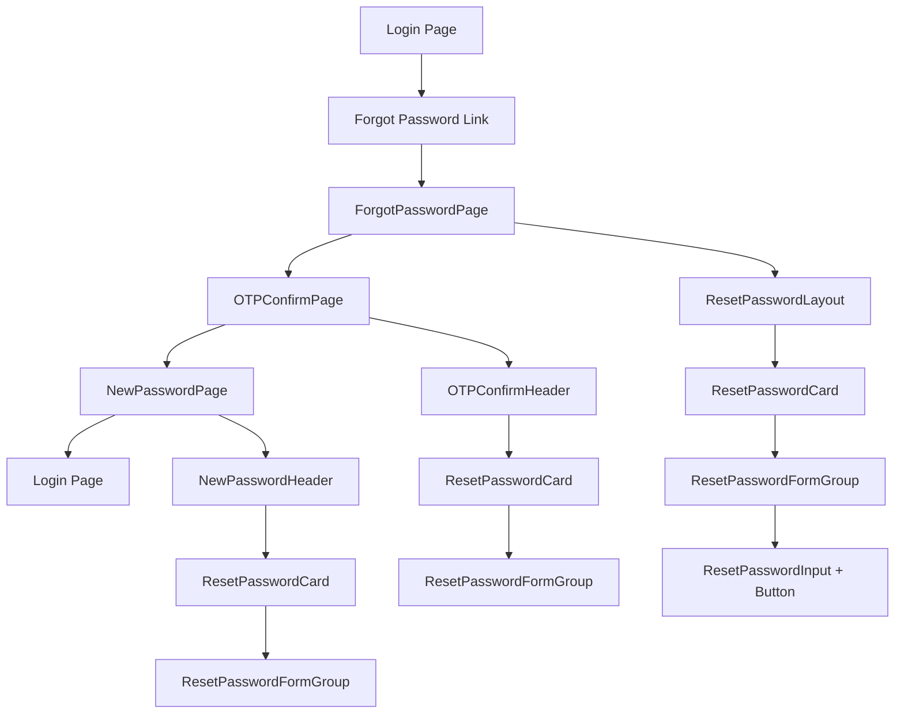

# Reset Password Flow Diagram

## Flow Diagram

```mermaid
sequenceDiagram
    participant U as User
    participant F as Frontend
    participant B as Backend
    participant D as Database

    Note over U,D: Tahap 1: Request Reset Password
    U->>F: Klik "Lupa Password" di Login
    F->>U: Tampilkan halaman ForgotPassword
    U->>F: Input email
    F->>B: POST /api/users/forgot-password
    B->>D: Cari user by email
    B->>D: Buat token reset password
    B->>F: Return token (untuk development)
    F->>U: Redirect ke halaman OTP

    Note over U,D: Tahap 2: Verifikasi OTP
    U->>F: Input kode OTP (token)
    F->>B: POST /api/users/verify-otp
    B->>D: Verifikasi token
    B->>D: Buat token verified
    B->>F: Return verified token
    F->>U: Redirect ke halaman New Password

    Note over U,D: Tahap 3: Set Password Baru
    U->>F: Input password baru
    F->>B: POST /api/users/reset-password
    B->>D: Verifikasi verified token
    B->>D: Hash password baru
    B->>D: Update password user
    B->>D: Mark token as used
    B->>F: Return success
    F->>U: Redirect ke Login
```

## Component Architecture

```mermaid
graph TD
    A[Pages] --> B[Organisms]
    B --> C[Molecules]
    C --> D[Atoms]

    A --> A1[ForgotPasswordPage]
    A --> A2[OTPConfirmPage]
    A --> A3[NewPasswordPage]

    B --> B1[ResetPasswordCard]
    B --> B2[ResetPasswordLayout]
    B --> B3[OTPConfirmHeader]
    B --> B4[NewPasswordHeader]

    C --> C1[ResetPasswordFormGroup]

    D --> D1[ResetPasswordInput]
    D --> D2[ResetPasswordButton]
    D --> D3[ResetPasswordLabel]
```

## Database Schema

```mermaid
erDiagram
    USERS {
        int id PK
        string email
        string password
        string nama_depan
        string nama_belakang
        datetime created_at
        datetime updated_at
    }

    USER_TOKENS {
        int id PK
        int user_id FK
        string token
        string type
        datetime expires_at
        datetime used_at
        datetime created_at
        datetime updated_at
    }

    USERS ||--o{ USER_TOKENS : "has many"
```

## API Flow

```mermaid
graph LR
    A[POST /forgot-password] --> B[POST /verify-otp]
    B --> C[POST /reset-password]
    
    A --> A1[Create password_reset token]
    B --> B1[Verify token & create password_reset_verified token]
    C --> C1[Update password & mark token used]
```

## UI Components Flow

```mermaid
graph TD
    A[Login Page] --> B[Forgot Password Link]
    B --> C[ForgotPasswordPage]
    C --> D[OTPConfirmPage]
    D --> E[NewPasswordPage]
    E --> F[Login Page]

    C --> C1[ResetPasswordLayout]
    C1 --> C2[ResetPasswordCard]
    C2 --> C3[ResetPasswordFormGroup]
    C3 --> C4[ResetPasswordInput + Button]

    D --> D1[OTPConfirmHeader]
    D1 --> D2[ResetPasswordCard]
    D2 --> D3[ResetPasswordFormGroup]

    E --> E1[NewPasswordHeader]
    E1 --> E2[ResetPasswordCard]
    E2 --> E3[ResetPasswordFormGroup]
```
