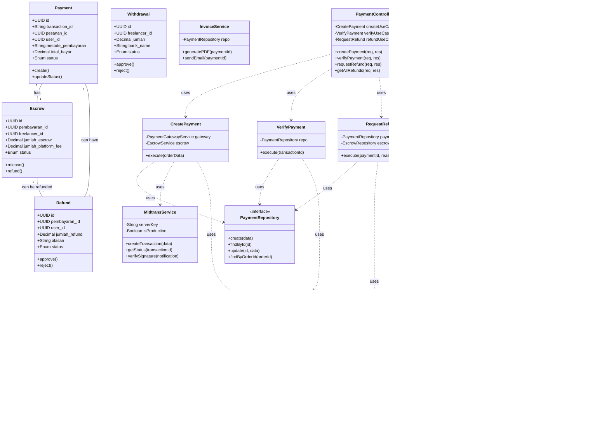

# Class Analysis Diagram - Payment Module

## Overview
Dokumen ini berisi daftar file/class yang dapat dijadikan dasar untuk membuat Class Diagram modul pembayaran menggunakan prinsip Clean Architecture.

## Architecture Layers

### 1. Domain Layer (Entity & Value Objects)
**Path:** `backend/src/modules/payment/domain/`

Belum ada file domain entities terpisah, tapi bisa di-extract dari models:

**Entities yang bisa dibuat:**
- `Payment.js` - Domain entity untuk pembayaran
- `Escrow.js` - Domain entity untuk escrow
- `Refund.js` - Domain entity untuk refund
- `Withdrawal.js` - Domain entity untuk withdrawal

**Value Objects:**
- `Money.js` - Value object untuk amount/currency
- `PaymentStatus.js` - Enum untuk payment status
- `EscrowStatus.js` - Enum untuk escrow status
- `RefundStatus.js` - Enum untuk refund status
- `WithdrawalStatus.js` - Enum untuk withdrawal status

---

### 2. Application Layer (Use Cases)
**Path:** `backend/src/modules/payment/application/use-cases/`

#### Payment Use Cases
```
✓ CreatePayment.js
✓ VerifyPayment.js
✓ RetryPayment.js
```

**Class Structure:**
```javascript
class CreatePayment {
  constructor({ paymentGatewayService, escrowService, orderRepository })
  async execute({ orderId, userId, paymentMethod, channel })
}

class VerifyPayment {
  constructor({ paymentRepository, escrowService })
  async execute({ transactionId, paymentData })
}

class RetryPayment {
  constructor({ paymentRepository, paymentGatewayService })
  async execute({ paymentId, userId, newPaymentMethod })
}
```

#### Escrow Use Cases
```
✓ ReleaseEscrow.js
```

**Class Structure:**
```javascript
class ReleaseEscrow {
  constructor({ escrowRepository, orderRepository })
  async execute({ escrowId, userId })
}
```

#### Refund Use Cases
```
✓ RequestRefund.js
✓ ProcessRefund.js
```

**Class Structure:**
```javascript
class RequestRefund {
  constructor({ paymentRepository, escrowRepository })
  async execute({ payment_id, user_id, reason })
}

class ProcessRefund {
  constructor({ refundRepository, escrowRepository })
  async execute({ refund_id, admin_id, action, catatan_admin }) // catatan_admin: NEW parameter
}
```

#### Withdrawal Use Cases
```
✓ WithdrawFunds.js
✓ GetPendingWithdrawals.js
✓ AdminApproveWithdrawal.js
✓ AdminRejectWithdrawal.js
```

**Class Structure:**
```javascript
class WithdrawFunds {
  constructor({ withdrawalService, escrowRepository })
  async execute({ freelancerId, amount, bankDetails })
}

class AdminApproveWithdrawal {
  constructor({ withdrawalRepository })
  async execute({ withdrawalId, adminId, buktiTransfer })
}

class AdminRejectWithdrawal {
  constructor({ withdrawalRepository })
  async execute({ withdrawalId, adminId, reason })
}
```

---

### 3. Infrastructure Layer (Models, Repositories, Services)

#### Models (Data Access)
**Path:** `backend/src/modules/payment/infrastructure/models/`

```
✓ PaymentModel.js - Sequelize model untuk tabel pembayaran
✓ EscrowModel.js - Sequelize model untuk tabel escrow
✓ RefundModel.js - Sequelize model untuk tabel refund
✓ WithdrawalModel.js - Sequelize model untuk tabel withdrawal
✓ PlatformConfigModel.js - Sequelize model untuk konfigurasi platform
```

**Class Structure:**
```javascript
// PaymentModel
class PaymentModel {
  // Attributes
  id: UUID
  transaction_id: String
  pesanan_id: UUID
  user_id: UUID
  metode_pembayaran: String
  payment_gateway: String
  total_bayar: Decimal
  status: Enum('menunggu', 'berhasil', 'gagal', 'kadaluarsa')

  // Associations
  belongsTo(PesananModel)
  belongsTo(UserModel)
  hasOne(EscrowModel)
  hasMany(RefundModel)
}
```

#### Repositories (Data Access Abstraction)
**Path:** `backend/src/modules/payment/infrastructure/repositories/`

File yang bisa dibuat:
```
□ SequelizePaymentRepository.js
□ SequelizeEscrowRepository.js
□ SequelizeRefundRepository.js
□ SequelizeWithdrawalRepository.js
```

**Class Structure:**
```javascript
class SequelizePaymentRepository {
  constructor(PaymentModel)

  async create(paymentData)
  async findById(id)
  async findByTransactionId(transactionId)
  async findByOrderId(orderId)
  async updateStatus(id, status)
  async update(id, data)
}

class SequelizeEscrowRepository {
  constructor(EscrowModel)

  async create(escrowData)
  async findById(id)
  async findByPaymentId(paymentId)
  async release(id, freelancerId)
  async updateStatus(id, status)
}

class SequelizeRefundRepository {
  constructor(RefundModel)

  async create(refundData)
  async findById(id)
  async findByPaymentId(paymentId)
  async updateStatus(id, status, adminNotes)
  async findAll(filters)
}

class SequelizeWithdrawalRepository {
  constructor(WithdrawalModel)

  async create(withdrawalData)
  async findById(id)
  async findByFreelancerId(freelancerId)
  async updateStatus(id, status, data)
  async findPending()
}
```

#### Services (Business Logic & External Integration)
**Path:** `backend/src/modules/payment/infrastructure/services/`

```
✓ MidtransService.js - Integrasi dengan Midtrans payment gateway
✓ MockPaymentGatewayService.js - Mock payment untuk development
✓ EscrowService.js - Business logic untuk escrow
✓ WithdrawalService.js - Business logic untuk withdrawal
✓ InvoiceService.js - Generate invoice PDF
✓ EmailService.js - Email notifications
```

**Class Structure:**
```javascript
class MidtransService {
  constructor({ serverKey, clientKey, isProduction })

  async createTransaction(paymentData)
  async getTransactionStatus(transactionId)
  async cancelTransaction(transactionId)
  verifySignature(notification)
}

class EscrowService {
  constructor({ escrowRepository, platformConfigService })

  async createEscrow(payment, order)
  async releaseEscrow(escrowId, userId)
  async calculateFees(amount)
  async getFreelancerBalance(freelancerId)
}

class WithdrawalService {
  constructor({ withdrawalRepository, escrowService })

  async requestWithdrawal(freelancerId, amount, bankDetails)
  async approveWithdrawal(withdrawalId, adminId, proof)
  async rejectWithdrawal(withdrawalId, adminId, reason)
  async getAvailableBalance(freelancerId)
}

class InvoiceService {
  constructor({ paymentRepository, orderRepository })

  async generateInvoice(paymentId)
  async sendInvoiceEmail(paymentId, email)
}
```

---

### 4. Presentation Layer (Controllers, Routes, DTOs)

#### Controllers
**Path:** `backend/src/modules/payment/presentation/controllers/`

```
✓ PaymentController.js - Handler untuk payment endpoints
✓ PlatformConfigController.js - Handler untuk platform config
```

**Class Structure:**
```javascript
class PaymentController {
  constructor({
    createPaymentUseCase,
    verifyPaymentUseCase,
    requestRefundUseCase,
    processRefundUseCase,
    withdrawFundsUseCase,
    // ... other use cases
  })

  // Payment endpoints
  async createPayment(req, res)
  async getPaymentById(req, res)
  async checkPaymentStatus(req, res)
  async handleWebhook(req, res)
  async retryPayment(req, res)

  // Escrow endpoints
  async releaseEscrow(req, res)
  async getAllEscrows(req, res)
  async getEscrowById(req, res)

  // Refund endpoints
  async requestRefund(req, res)
  async requestRefundAlt(req, res)
  async processRefund(req, res)
  async getAllRefunds(req, res)

  // Withdrawal endpoints
  async createWithdrawal(req, res)
  async getWithdrawalHistory(req, res)
  async getWithdrawalById(req, res)
  async adminGetWithdrawals(req, res)
  async adminApproveWithdrawal(req, res)
  async adminRejectWithdrawal(req, res)

  // Analytics endpoints
  async getAnalyticsSummary(req, res)
  async getFreelancerEarnings(req, res)
  async getClientSpending(req, res)

  // Invoice endpoints
  async getInvoice(req, res)
  async sendInvoice(req, res)

  // Balance endpoint
  async getUserBalance(req, res)
}

class PlatformConfigController {
  constructor({ platformConfigRepository })

  async getFees(req, res)
  async updateFees(req, res)
  async getConfig(req, res)
  async updateConfig(req, res)
}
```

#### Routes
**Path:** `backend/src/modules/payment/presentation/routes/`

```
✓ paymentRoutes.js - Route definitions
```

---

## Class Diagram (Mermaid)



---

## File List untuk Class Diagram

### Domain Layer (To be created)
```
□ backend/src/modules/payment/domain/entities/Payment.js
□ backend/src/modules/payment/domain/entities/Escrow.js
□ backend/src/modules/payment/domain/entities/Refund.js
□ backend/src/modules/payment/domain/entities/Withdrawal.js
□ backend/src/modules/payment/domain/value-objects/Money.js
□ backend/src/modules/payment/domain/value-objects/PaymentStatus.js
```

### Application Layer
```
✓ backend/src/modules/payment/application/use-cases/CreatePayment.js
✓ backend/src/modules/payment/application/use-cases/VerifyPayment.js
✓ backend/src/modules/payment/application/use-cases/RetryPayment.js
✓ backend/src/modules/payment/application/use-cases/ReleaseEscrow.js
✓ backend/src/modules/payment/application/use-cases/RequestRefund.js
✓ backend/src/modules/payment/application/use-cases/ProcessRefund.js
✓ backend/src/modules/payment/application/use-cases/WithdrawFunds.js
✓ backend/src/modules/payment/application/use-cases/GetPendingWithdrawals.js
✓ backend/src/modules/payment/application/use-cases/AdminApproveWithdrawal.js
✓ backend/src/modules/payment/application/use-cases/AdminRejectWithdrawal.js
```

### Infrastructure Layer - Models
```
✓ backend/src/modules/payment/infrastructure/models/PaymentModel.js
✓ backend/src/modules/payment/infrastructure/models/EscrowModel.js
✓ backend/src/modules/payment/infrastructure/models/RefundModel.js
✓ backend/src/modules/payment/infrastructure/models/WithdrawalModel.js
✓ backend/src/modules/payment/infrastructure/models/PlatformConfigModel.js
```

### Infrastructure Layer - Repositories (To be created/extracted)
```
□ backend/src/modules/payment/infrastructure/repositories/PaymentRepository.js (interface)
□ backend/src/modules/payment/infrastructure/repositories/SequelizePaymentRepository.js
□ backend/src/modules/payment/infrastructure/repositories/EscrowRepository.js (interface)
□ backend/src/modules/payment/infrastructure/repositories/SequelizeEscrowRepository.js
□ backend/src/modules/payment/infrastructure/repositories/RefundRepository.js (interface)
□ backend/src/modules/payment/infrastructure/repositories/SequelizeRefundRepository.js
□ backend/src/modules/payment/infrastructure/repositories/WithdrawalRepository.js (interface)
□ backend/src/modules/payment/infrastructure/repositories/SequelizeWithdrawalRepository.js
```

### Infrastructure Layer - Services
```
✓ backend/src/modules/payment/infrastructure/services/MidtransService.js
✓ backend/src/modules/payment/infrastructure/services/MockPaymentGatewayService.js
✓ backend/src/modules/payment/infrastructure/services/EscrowService.js
✓ backend/src/modules/payment/infrastructure/services/WithdrawalService.js
✓ backend/src/modules/payment/infrastructure/services/InvoiceService.js
✓ backend/src/modules/payment/infrastructure/services/EmailService.js
```

### Presentation Layer
```
✓ backend/src/modules/payment/presentation/controllers/PaymentController.js
✓ backend/src/modules/payment/presentation/controllers/PlatformConfigController.js
✓ backend/src/modules/payment/presentation/routes/paymentRoutes.js
```

---

## Design Patterns Used

### 1. Repository Pattern
- Abstraksi data access layer
- Files: All `*Repository.js`

### 2. Use Case Pattern (Clean Architecture)
- Single responsibility per use case
- Files: All `use-cases/*.js`

### 3. Service Pattern
- External integrations & complex business logic
- Files: All `services/*.js`

### 4. Model-View-Controller (MVC)
- Controllers handle HTTP requests
- Models represent data
- Routes define endpoints

### 5. Dependency Injection
- Use cases receive dependencies via constructor
- Easier testing and decoupling

### 6. Strategy Pattern
- Multiple payment gateways (Midtrans, Xendit, Mock)
- PaymentGatewayService interface

---

## Recommendations untuk UML Tool

**Tools yang bisa digunakan:**
1. **Draw.io / diagrams.net** - Free, support UML
2. **PlantUML** - Text-based UML (bisa di-integrate dengan dokumentasi)
3. **Lucidchart** - Professional, berbayar
4. **StarUML** - Desktop app, gratis untuk basic features
5. **Mermaid** - Text-based, bisa embedded di Markdown (sudah ada contoh di atas)

**Export dari code:**
- Bisa pakai tools seperti `tsuml2` atau `typescript-uml` untuk auto-generate
- Manual lebih baik untuk dokumentasi yang clear dan fokus

---

## Recent Updates & Enhancements (2025)

### 1. Refund Processing Enhancement
**Use Case**: `ProcessRefund.js`
- **New Parameter**: `catatan_admin` - Admin dapat memberikan notes saat approve/reject refund
- **Controller**: `PaymentController.processRefund()` - Menerima dan menyimpan catatan admin
- **API Enhancement**: `GET /api/payments/refunds` - Mengembalikan detail lengkap order dan layanan

**Example Usage**:
```javascript
// Admin approve refund dengan catatan
await processRefundUseCase.execute({
  refund_id: 'uuid',
  admin_id: 'admin-uuid',
  action: 'approve',
  catatan_admin: 'Refund disetujui karena layanan tidak sesuai deskripsi'
});

// Admin reject refund dengan catatan
await processRefundUseCase.execute({
  refund_id: 'uuid',
  admin_id: 'admin-uuid',
  action: 'reject',
  catatan_admin: 'Bukti tidak cukup, mohon upload screenshot tambahan'
});
```

### 2. Withdrawal Module Enhancement
**Service**: `WithdrawalService.js`
- **FIFO Escrow Selection**: Otomatis memilih escrows dengan First-In-First-Out untuk memenuhi jumlah withdrawal
- **Flexible Amount**: Freelancer bisa withdraw sejumlah apapun dari available balance
- **Bank Name Field**: Support untuk menyimpan nama bank spesifik (BCA, BRI, Mandiri, dll)

### 3. Analytics Enhancement
**Controller**: `PaymentController.js`
- **Role-Based Analytics**: Different analytics untuk freelancer, client, dan admin
- **New Endpoints**:
  - `GET /api/payments/analytics/summary` - Summary berdasarkan role
  - `GET /api/payments/analytics/freelancer-earnings` - Earning freelancer
  - `GET /api/payments/analytics/client-spending` - Spending client
  - `GET /api/payments/balance` - Freelancer balance

### 4. Platform Configuration
**Controller**: `PlatformConfigController.js`
- **Dynamic Fee Management**: Admin dapat update platform fee via API
- **Category-Based Config**: Config diorganisir berdasarkan kategori
- **Data Type Validation**: Validasi tipe data (string, number, boolean, json)

---

## Updated Class Diagram for Refund Module


---

## Notes
- ✓ = File sudah ada
- □ = File belum ada, recommended untuk dibuat
- Semua file yang ✓ bisa langsung digunakan untuk class diagram
- Files dengan □ adalah recommended refactoring untuk clean architecture
- **Documentation Updated**: 2025-12-27 - Added recent enhancements and new features
