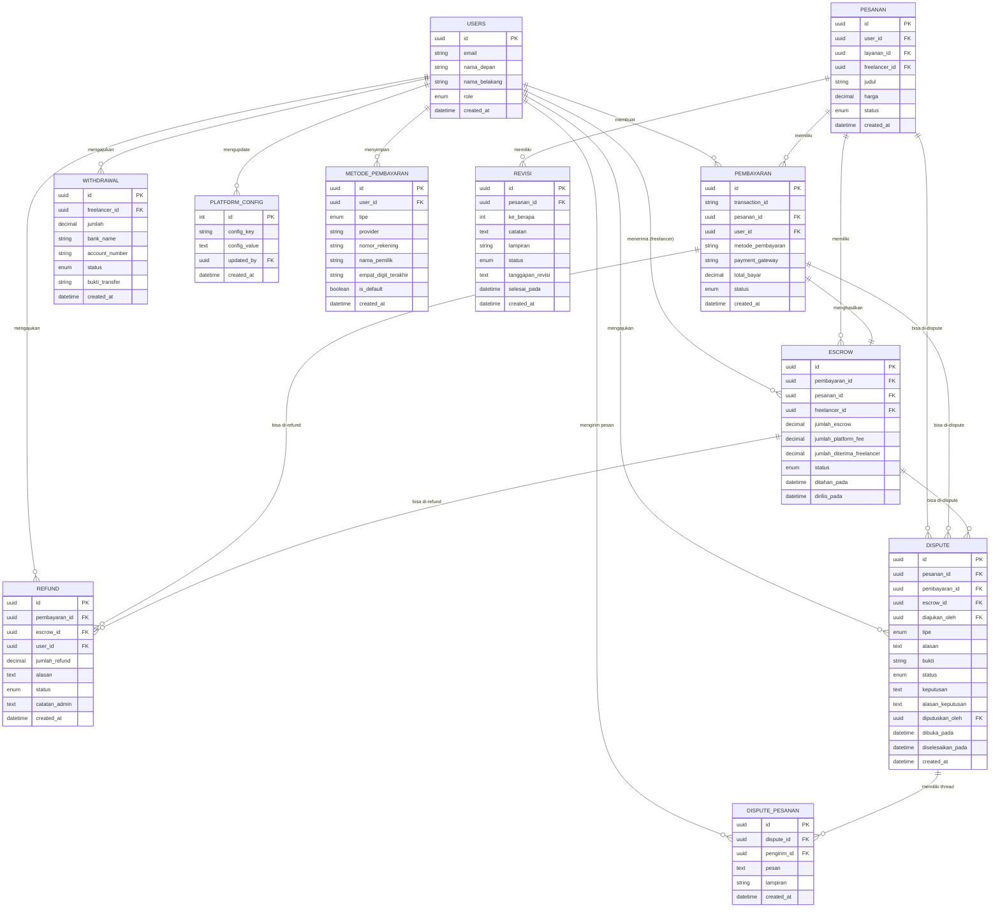

# Entity Relationship Diagram - Payment Module

## Overview
Modul pembayaran mengelola seluruh transaksi keuangan di platform SkillConnect, termasuk pembayaran, escrow, refund, withdrawal, dispute, dan revisi pesanan.

**Total: 10 Tabel** (lengkap dari erdmod4.jpeg)

## Table Summary

| No | Tabel | Kategori | Deskripsi |
|----|-------|----------|-----------|
| 1 | `pembayaran` | Core Payment | Transaksi pembayaran dari client |
| 2 | `escrow` | Core Payment | Pengelolaan dana escrow |
| 3 | `refund` | Core Payment | Request refund dari client |
| 4 | `pencairan_dana` (withdrawal) | Core Payment | Penarikan dana freelancer |
| 5 | `platform_config` | Core Payment | Konfigurasi platform fee |
| 6 | `metode_pembayaran` | Additional | Saved payment methods user |
| 7 | `revisi` | Additional | Revisi pesanan dari client |
| 8 | `dispute` | Additional | Dispute management |
| 9 | `dispute_pesanan` | Additional | Dispute messages/thread |
| 10 | `users`, `pesanan`, `layanan` | Referenced | Dari modul lain |

---

## Entities

### 1. Pembayaran (Payment)
**Table:** `pembayaran`

| Atribut | Tipe | Deskripsi |
|---------|------|-----------|
| id | UUID (PK) | Primary key |
| transaction_id | VARCHAR(255) | ID transaksi dari payment gateway |
| pesanan_id | UUID (FK) | Foreign key ke tabel pesanan |
| user_id | UUID (FK) | Foreign key ke tabel users (client) |
| metode_pembayaran | VARCHAR(50) | Metode pembayaran (e-wallet, va, credit_card) |
| payment_gateway | VARCHAR(50) | Gateway yang digunakan (midtrans, xendit, mock) |
| channel | VARCHAR(100) | Channel spesifik (gopay, bca_va, dll) |
| jumlah_pesanan | DECIMAL(10,2) | Total harga layanan |
| biaya_platform | DECIMAL(10,2) | Fee platform (%) |
| biaya_gateway | DECIMAL(10,2) | Fee payment gateway (%) |
| total_bayar | DECIMAL(10,2) | Total yang harus dibayar |
| status | ENUM | Status: menunggu, berhasil, gagal, kadaluarsa |
| payment_url | VARCHAR(255) | URL pembayaran |
| invoice_url | VARCHAR(255) | URL invoice PDF |
| dibayar_pada | DATETIME | Waktu pembayaran berhasil |
| kadaluarsa_pada | DATETIME | Waktu kadaluarsa |
| created_at | DATETIME | Waktu dibuat |
| updated_at | DATETIME | Waktu terakhir diupdate |

**Relationships:**
- `pesanan_id` → `pesanan.id` (Many-to-One)
- `user_id` → `users.id` (Many-to-One)
- One-to-One dengan `escrow`
- One-to-Many dengan `refund`

---

### 2. Escrow
**Table:** `escrow`

| Atribut | Tipe | Deskripsi |
|---------|------|-----------|
| id | UUID (PK) | Primary key |
| pembayaran_id | UUID (FK, Unique) | Foreign key ke pembayaran |
| pesanan_id | UUID (FK) | Foreign key ke pesanan |
| freelancer_id | UUID (FK) | Foreign key ke users (freelancer) |
| jumlah_escrow | DECIMAL(10,2) | Jumlah yang di-hold |
| jumlah_platform_fee | DECIMAL(10,2) | Fee platform yang dipotong |
| jumlah_diterima_freelancer | DECIMAL(10,2) | Jumlah bersih untuk freelancer |
| status | ENUM | Status: held, released, refunded, disputed, completed |
| ditahan_pada | DATETIME | Waktu dana ditahan |
| dirilis_pada | DATETIME | Waktu dana dirilis |
| created_at | DATETIME | Waktu dibuat |
| updated_at | DATETIME | Waktu terakhir diupdate |

**Relationships:**
- `pembayaran_id` → `pembayaran.id` (One-to-One)
- `pesanan_id` → `pesanan.id` (Many-to-One)
- `freelancer_id` → `users.id` (Many-to-One)

---

### 3. Refund
**Table:** `refund`

| Atribut | Tipe | Deskripsi |
|---------|------|-----------|
| id | UUID (PK) | Primary key |
| pembayaran_id | UUID (FK) | Foreign key ke pembayaran |
| escrow_id | UUID (FK) | Foreign key ke escrow |
| user_id | UUID (FK) | Foreign key ke users (client) |
| jumlah_refund | DECIMAL(10,2) | Jumlah yang di-refund |
| alasan | TEXT | Alasan refund dari client |
| status | ENUM | Status: pending, processing, completed, failed |
| transaction_id | VARCHAR(255) | ID transaksi refund |
| diproses_pada | DATETIME | Waktu diproses admin |
| selesai_pada | DATETIME | Waktu refund selesai |
| catatan_admin | TEXT | Catatan dari admin saat approve/reject (**NEW**) |
| created_at | DATETIME | Waktu request dibuat |
| updated_at | DATETIME | Waktu terakhir diupdate |

**Relationships:**
- `pembayaran_id` → `pembayaran.id` (Many-to-One)
- `escrow_id` → `escrow.id` (Many-to-One)
- `user_id` → `users.id` (Many-to-One)

**Business Rules:**
- Refund hanya bisa diajukan untuk pembayaran dengan status 'berhasil'
- Admin approve → status 'processing' (menunggu freelancer transfer)
- Admin reject → status 'failed'
- Setelah freelancer transfer → status 'completed'

---

### 4. Withdrawal
**Table:** `withdrawal`

| Atribut | Tipe | Deskripsi |
|---------|------|-----------|
| id | UUID (PK) | Primary key |
| freelancer_id | UUID (FK) | Foreign key ke users (freelancer) |
| jumlah | DECIMAL(10,2) | Jumlah withdrawal |
| bank_name | VARCHAR(100) | Nama bank |
| account_number | VARCHAR(50) | Nomor rekening |
| account_name | VARCHAR(255) | Nama pemilik rekening |
| status | ENUM | Status: pending, processing, completed, failed |
| bukti_transfer | VARCHAR(255) | URL bukti transfer dari admin |
| catatan | TEXT | Catatan dari admin |
| diajukan_pada | DATETIME | Waktu pengajuan |
| diproses_pada | DATETIME | Waktu diproses |
| selesai_pada | DATETIME | Waktu selesai |
| created_at | DATETIME | Waktu dibuat |
| updated_at | DATETIME | Waktu terakhir diupdate |

**Relationships:**
- `freelancer_id` → `users.id` (Many-to-One)

**Business Rules:**
- Freelancer hanya bisa withdraw dari balance yang tersedia
- Balance = total escrow released - total withdrawn
- Minimum withdrawal biasanya Rp 50,000

---

### 5. Platform Config
**Table:** `platform_config`

| Atribut | Tipe | Deskripsi |
|---------|------|-----------|
| id | INT (PK, Auto-increment) | Primary key |
| config_key | VARCHAR(255, Unique) | Key konfigurasi |
| config_value | TEXT | Value konfigurasi (JSON/String) |
| description | TEXT | Deskripsi konfigurasi |
| updated_by | UUID (FK) | User yang terakhir update |
| created_at | DATETIME | Waktu dibuat |
| updated_at | DATETIME | Waktu terakhir diupdate |

**Relationships:**
- `updated_by` → `users.id` (Many-to-One)

**Config Keys:**
- `platform_fee_percentage`: Fee platform (default 5.0%)
- `payment_gateway_fee_percentage`: Fee payment gateway (default 2.5%)
- `minimum_withdrawal_amount`: Minimum withdrawal

---

## Entity Relationship Diagram (Mermaid)



---

## Database Schema SQL

```sql
-- 1. Pembayaran Table
CREATE TABLE pembayaran (
    id CHAR(36) PRIMARY KEY,
    transaction_id VARCHAR(255) UNIQUE,
    pesanan_id CHAR(36) NOT NULL,
    user_id CHAR(36) NOT NULL,
    metode_pembayaran VARCHAR(50),
    payment_gateway VARCHAR(50) DEFAULT 'midtrans',
    channel VARCHAR(100),
    jumlah_pesanan DECIMAL(10,2) NOT NULL,
    biaya_platform DECIMAL(10,2) NOT NULL DEFAULT 0,
    biaya_gateway DECIMAL(10,2) NOT NULL DEFAULT 0,
    total_bayar DECIMAL(10,2) NOT NULL,
    status ENUM('menunggu', 'berhasil', 'gagal', 'kadaluarsa') DEFAULT 'menunggu',
    payment_url VARCHAR(255),
    invoice_url VARCHAR(255),
    dibayar_pada DATETIME,
    kadaluarsa_pada DATETIME,
    created_at DATETIME DEFAULT CURRENT_TIMESTAMP,
    updated_at DATETIME DEFAULT CURRENT_TIMESTAMP ON UPDATE CURRENT_TIMESTAMP,

    FOREIGN KEY (pesanan_id) REFERENCES pesanan(id),
    FOREIGN KEY (user_id) REFERENCES users(id),
    INDEX idx_transaction_id (transaction_id),
    INDEX idx_pesanan_id (pesanan_id),
    INDEX idx_user_id (user_id),
    INDEX idx_status (status)
);

-- 2. Escrow Table
CREATE TABLE escrow (
    id CHAR(36) PRIMARY KEY,
    pembayaran_id CHAR(36) UNIQUE NOT NULL,
    pesanan_id CHAR(36) NOT NULL,
    freelancer_id CHAR(36) NOT NULL,
    jumlah_escrow DECIMAL(10,2) NOT NULL,
    jumlah_platform_fee DECIMAL(10,2) NOT NULL DEFAULT 0,
    jumlah_diterima_freelancer DECIMAL(10,2) NOT NULL,
    status ENUM('held', 'released', 'refunded', 'disputed', 'completed') DEFAULT 'held',
    ditahan_pada DATETIME,
    dirilis_pada DATETIME,
    created_at DATETIME DEFAULT CURRENT_TIMESTAMP,
    updated_at DATETIME DEFAULT CURRENT_TIMESTAMP ON UPDATE CURRENT_TIMESTAMP,

    FOREIGN KEY (pembayaran_id) REFERENCES pembayaran(id),
    FOREIGN KEY (pesanan_id) REFERENCES pesanan(id),
    FOREIGN KEY (freelancer_id) REFERENCES users(id),
    INDEX idx_pembayaran_id (pembayaran_id),
    INDEX idx_pesanan_id (pesanan_id),
    INDEX idx_freelancer_id (freelancer_id),
    INDEX idx_status (status)
);

-- 3. Refund Table
CREATE TABLE refund (
    id CHAR(36) PRIMARY KEY,
    pembayaran_id CHAR(36) NOT NULL,
    escrow_id CHAR(36) NOT NULL,
    user_id CHAR(36) NOT NULL,
    jumlah_refund DECIMAL(10,2) NOT NULL,
    alasan TEXT NOT NULL,
    status ENUM('pending', 'processing', 'completed', 'failed') DEFAULT 'pending',
    transaction_id VARCHAR(255),
    diproses_pada DATETIME,
    selesai_pada DATETIME,
    catatan_admin TEXT,
    created_at DATETIME DEFAULT CURRENT_TIMESTAMP,
    updated_at DATETIME DEFAULT CURRENT_TIMESTAMP ON UPDATE CURRENT_TIMESTAMP,

    FOREIGN KEY (pembayaran_id) REFERENCES pembayaran(id),
    FOREIGN KEY (escrow_id) REFERENCES escrow(id),
    FOREIGN KEY (user_id) REFERENCES users(id),
    INDEX idx_pembayaran_id (pembayaran_id),
    INDEX idx_user_id (user_id),
    INDEX idx_status (status)
);

-- 4. Withdrawal Table
CREATE TABLE withdrawal (
    id CHAR(36) PRIMARY KEY,
    freelancer_id CHAR(36) NOT NULL,
    jumlah DECIMAL(10,2) NOT NULL,
    bank_name VARCHAR(100) NOT NULL,
    account_number VARCHAR(50) NOT NULL,
    account_name VARCHAR(255) NOT NULL,
    status ENUM('pending', 'processing', 'completed', 'failed') DEFAULT 'pending',
    bukti_transfer VARCHAR(255),
    catatan TEXT,
    diajukan_pada DATETIME,
    diproses_pada DATETIME,
    selesai_pada DATETIME,
    created_at DATETIME DEFAULT CURRENT_TIMESTAMP,
    updated_at DATETIME DEFAULT CURRENT_TIMESTAMP ON UPDATE CURRENT_TIMESTAMP,

    FOREIGN KEY (freelancer_id) REFERENCES users(id),
    INDEX idx_freelancer_id (freelancer_id),
    INDEX idx_status (status)
);

-- 5. Platform Config Table
CREATE TABLE platform_config (
    id INT AUTO_INCREMENT PRIMARY KEY,
    config_key VARCHAR(255) UNIQUE NOT NULL,
    config_value TEXT NOT NULL,
    description TEXT,
    updated_by CHAR(36),
    created_at DATETIME DEFAULT CURRENT_TIMESTAMP,
    updated_at DATETIME DEFAULT CURRENT_TIMESTAMP ON UPDATE CURRENT_TIMESTAMP,

    FOREIGN KEY (updated_by) REFERENCES users(id),
    INDEX idx_config_key (config_key)
);

-- 6. Metode Pembayaran (Saved Payment Methods) Table
CREATE TABLE metode_pembayaran (
    id CHAR(36) PRIMARY KEY,
    user_id CHAR(36) NOT NULL,
    tipe ENUM('e_wallet', 'bank_transfer', 'credit_card') NOT NULL,
    provider VARCHAR(100) NOT NULL,
    nomor_rekening VARCHAR(255) NOT NULL, -- Encrypted
    nama_pemilik VARCHAR(255) NOT NULL,
    empat_digit_terakhir VARCHAR(50),
    is_default BOOLEAN DEFAULT FALSE,
    created_at DATETIME DEFAULT CURRENT_TIMESTAMP,
    updated_at DATETIME DEFAULT CURRENT_TIMESTAMP ON UPDATE CURRENT_TIMESTAMP,

    FOREIGN KEY (user_id) REFERENCES users(id),
    INDEX idx_user_id (user_id),
    INDEX idx_user_default (user_id, is_default)
);

-- 7. Revisi Pesanan Table
CREATE TABLE revisi (
    id CHAR(36) PRIMARY KEY,
    pesanan_id CHAR(36) NOT NULL,
    ke_berapa INT NOT NULL,
    catatan TEXT NOT NULL,
    lampiran VARCHAR(255),
    status ENUM('pending', 'diterima', 'ditolak') DEFAULT 'pending',
    tanggapan_revisi TEXT,
    selesai_pada DATETIME,
    created_at DATETIME DEFAULT CURRENT_TIMESTAMP,
    updated_at DATETIME DEFAULT CURRENT_TIMESTAMP ON UPDATE CURRENT_TIMESTAMP,

    FOREIGN KEY (pesanan_id) REFERENCES pesanan(id),
    INDEX idx_pesanan_id (pesanan_id),
    INDEX idx_status (status),
    UNIQUE KEY unique_pesanan_revision (pesanan_id, ke_berapa)
);

-- 8. Dispute Table
CREATE TABLE dispute (
    id CHAR(36) PRIMARY KEY,
    pesanan_id CHAR(36) NOT NULL,
    pembayaran_id CHAR(36) NOT NULL,
    escrow_id CHAR(36) NOT NULL,
    diajukan_oleh CHAR(36) NOT NULL,
    tipe ENUM('quality_issue', 'delivery_late', 'scope_change', 'payment_issue') NOT NULL,
    alasan TEXT NOT NULL,
    bukti VARCHAR(255),
    status ENUM('open', 'investigating', 'resolved', 'closed') DEFAULT 'open',
    keputusan TEXT,
    alasan_keputusan TEXT,
    diputuskan_oleh CHAR(36),
    dibuka_pada DATETIME,
    diselesaikan_pada DATETIME,
    created_at DATETIME DEFAULT CURRENT_TIMESTAMP,
    updated_at DATETIME DEFAULT CURRENT_TIMESTAMP ON UPDATE CURRENT_TIMESTAMP,

    FOREIGN KEY (pesanan_id) REFERENCES pesanan(id),
    FOREIGN KEY (pembayaran_id) REFERENCES pembayaran(id),
    FOREIGN KEY (escrow_id) REFERENCES escrow(id),
    FOREIGN KEY (diajukan_oleh) REFERENCES users(id),
    FOREIGN KEY (diputuskan_oleh) REFERENCES users(id),
    INDEX idx_pesanan_id (pesanan_id),
    INDEX idx_status (status),
    INDEX idx_diajukan_oleh (diajukan_oleh)
);

-- 9. Dispute Pesanan (Dispute Messages/Thread) Table
CREATE TABLE dispute_pesanan (
    id CHAR(36) PRIMARY KEY,
    dispute_id CHAR(36) NOT NULL,
    pengirim_id CHAR(36) NOT NULL,
    pesan TEXT NOT NULL,
    lampiran VARCHAR(255),
    created_at DATETIME DEFAULT CURRENT_TIMESTAMP,

    FOREIGN KEY (dispute_id) REFERENCES dispute(id) ON DELETE CASCADE,
    FOREIGN KEY (pengirim_id) REFERENCES users(id),
    INDEX idx_dispute_id (dispute_id),
    INDEX idx_created_at (created_at)
);
```

---

## Workflow Diagrams

### 1. Payment Flow
```
Client → Create Order → Create Payment → Payment Gateway → Webhook
                                                               ↓
                                                        Update Status
                                                               ↓
                                              [Berhasil] → Create Escrow
                                              [Gagal/Expired] → Mark as Failed
```

### 2. Escrow Flow
```
Payment Success → Create Escrow (status: held)
                        ↓
                  Order Completed by Client
                        ↓
                  Release Escrow (status: released)
                        ↓
                  Add to Freelancer Balance
```

### 3. Refund Flow
```
Client → Request Refund (status: pending)
              ↓
        Admin Reviews
              ↓
    [Approve] → status: processing → Freelancer Transfers → status: completed
              ↓
    [Reject]  → status: failed
```

### 4. Withdrawal Flow
```
Freelancer → Request Withdrawal (status: pending)
                   ↓
             Admin Reviews
                   ↓
    [Approve] → Upload Bukti Transfer → status: completed
                   ↓
    [Reject]  → status: failed
```

### 5. Dispute Flow
```
User (Client/Freelancer) → Open Dispute (status: open)
                                 ↓
                          Admin Investigates (status: investigating)
                                 ↓
                          Escrow di-hold
                                 ↓
                    ┌────────────┴────────────┐
                    │   Dispute Messages      │
                    │   (dispute_pesanan)     │
                    │   - Client posts        │
                    │   - Freelancer replies  │
                    │   - Admin mediates      │
                    └────────────┬────────────┘
                                 ↓
                          Admin Decision
                                 ↓
              ┌─────────────────┼─────────────────┐
              ▼                 ▼                 ▼
        Refund Penuh      Refund Sebagian    Lanjutkan Pesanan
              │                 │                 │
              ▼                 ▼                 ▼
        Escrow → Client   Escrow Split     Escrow → Freelancer
              │                 │                 │
              └─────────────────┴─────────────────┘
                                 ↓
                         status: resolved
```

### 6. Revisi Flow
```
Client → Request Revision
              ↓
        Create Revisi (status: pending)
              ↓
        Freelancer Reviews
              ↓
    ┌─────────┴─────────┐
    ▼                   ▼
[Terima]           [Tolak]
    │                   │
    ▼                   ▼
Work on Revision   status: ditolak
    │
    ▼
Submit Revision
    │
    ▼
status: diterima
```

---

## Business Rules

### Payment
1. Payment harus terhubung dengan Order yang valid
2. Total bayar = jumlah_pesanan + biaya_platform + biaya_gateway
3. Payment expired setelah 24 jam jika tidak dibayar
4. Satu order hanya bisa memiliki satu payment yang berhasil

### Escrow
1. Escrow otomatis dibuat saat payment berhasil
2. Jumlah escrow = total_bayar - biaya_gateway
3. Platform fee dipotong dari escrow saat release
4. Escrow hanya bisa dirilis oleh client setelah order selesai
5. Admin bisa intervensi untuk dispute

### Refund
1. Refund hanya bisa diajukan untuk payment yang berhasil
2. Jumlah refund = total yang dibayarkan (full refund)
3. Admin harus approve/reject refund request
4. Jika approved, freelancer yang harus transfer kembali ke client
5. Status 'processing' menunggu konfirmasi transfer dari freelancer

### Withdrawal
1. Minimum withdrawal amount (configureable via platform_config)
2. Freelancer balance = total escrow released - total withdrawn
3. Admin harus upload bukti transfer saat approve
4. Withdrawal bisa ditolak jika data rekening tidak valid

### Platform Config
1. Fee platform dan gateway bisa diubah oleh admin
2. Perubahan fee hanya berlaku untuk transaksi baru
3. Transaksi lama tetap menggunakan fee saat transaksi dibuat

### Metode Pembayaran
1. User bisa menyimpan multiple payment methods untuk quick checkout
2. Hanya satu metode bisa dijadikan default per user
3. Nomor rekening harus di-encrypt di database
4. Display hanya menampilkan 4 digit terakhir untuk security
5. User bisa hapus payment method kapan saja

### Revisi
1. Jumlah revisi dibatasi sesuai paket layanan yang dibeli
2. Revisi hanya bisa diminta jika pesanan masih in_progress
3. Auto-increment `ke_berapa` untuk tracking revisi
4. Freelancer bisa terima atau tolak revisi request
5. Jika ditolak, client tidak kehilangan kuota revisi

### Dispute
1. Dispute hanya bisa diajukan setelah pembayaran berhasil
2. Saat dispute investigating, escrow otomatis di-hold
3. Both client dan freelancer bisa mengirim pesan dalam dispute
4. Admin harus memberikan keputusan dalam 7 hari kerja
5. Keputusan bisa: refund penuh, refund sebagian, atau lanjutkan pesanan
6. Setelah resolved, escrow dirilis sesuai keputusan admin
7. Dispute closed tidak bisa dibuka kembali

### Dispute Pesanan (Messages)
1. Thread komunikasi antara client, freelancer, dan admin
2. Semua pihak bisa upload bukti/attachment
3. Messages tidak bisa diedit atau dihapus (audit trail)
4. Auto-delete saat parent dispute dihapus (CASCADE)

---

## Indexes untuk Performance

```sql
-- Payment indexes
CREATE INDEX idx_payment_status_created ON pembayaran(status, created_at DESC);
CREATE INDEX idx_payment_user_status ON pembayaran(user_id, status);

-- Escrow indexes
CREATE INDEX idx_escrow_freelancer_status ON escrow(freelancer_id, status);
CREATE INDEX idx_escrow_status_created ON escrow(status, created_at DESC);

-- Refund indexes
CREATE INDEX idx_refund_status_created ON refund(status, created_at DESC);

-- Withdrawal indexes
CREATE INDEX idx_withdrawal_freelancer_status ON withdrawal(freelancer_id, status);
CREATE INDEX idx_withdrawal_status_created ON withdrawal(status, created_at DESC);

-- Metode Pembayaran indexes
CREATE INDEX idx_metode_user_id ON metode_pembayaran(user_id);
CREATE INDEX idx_metode_user_default ON metode_pembayaran(user_id, is_default);

-- Revisi indexes
CREATE INDEX idx_revisi_pesanan_status ON revisi(pesanan_id, status);
CREATE INDEX idx_revisi_created ON revisi(created_at DESC);

-- Dispute indexes
CREATE INDEX idx_dispute_pesanan_id ON dispute(pesanan_id);
CREATE INDEX idx_dispute_status_created ON dispute(status, created_at DESC);
CREATE INDEX idx_dispute_diajukan_oleh ON dispute(diajukan_oleh);

-- Dispute Pesanan indexes
CREATE INDEX idx_dispute_msg_dispute_id ON dispute_pesanan(dispute_id);
CREATE INDEX idx_dispute_msg_created ON dispute_pesanan(created_at DESC);
```

---

### 6. Metode Pembayaran (Saved Payment Methods)
**Table:** `metode_pembayaran`

| Atribut | Tipe | Deskripsi |
|---------|------|-----------|
| id | UUID (PK) | Primary key |
| user_id | UUID (FK) | Foreign key ke users |
| tipe | ENUM | Tipe metode: e_wallet, bank_transfer, credit_card |
| provider | VARCHAR(100) | Provider: gopay, ovo, bca, mandiri, dll |
| nomor_rekening | VARCHAR(50) | Nomor rekening/akun (encrypted) |
| nama_pemilik | VARCHAR(255) | Nama pemilik rekening |
| email_digi_terakhir | VARCHAR(50) | 4 digit terakhir untuk display |
| is_default | BOOLEAN | Apakah metode pembayaran default |
| created_at | DATETIME | Waktu dibuat |
| updated_at | DATETIME | Waktu terakhir diupdate |

**Relationships:**
- `user_id` → `users.id` (Many-to-One)

**Business Rules:**
- User bisa menyimpan multiple payment methods
- Hanya satu metode bisa dijadikan default per user
- Data sensitif (nomor rekening) harus di-encrypt
- Untuk display, hanya tampilkan 4 digit terakhir

---

### 7. Revisi Pesanan
**Table:** `revisi`

| Atribut | Tipe | Deskripsi |
|---------|------|-----------|
| id | UUID (PK) | Primary key |
| pesanan_id | UUID (FK) | Foreign key ke pesanan |
| ke_berapa | INT | Revisi ke berapa |
| catatan | TEXT | Catatan revisi dari client |
| lampiran | VARCHAR(255) | URL file lampiran (optional) |
| status | ENUM | Status: pending, diterima, ditolak |
| tanggapan_revisi | TEXT | Tanggapan dari freelancer |
| selesai_pada | DATETIME | Waktu revisi selesai |
| created_at | DATETIME | Waktu revisi diminta |
| updated_at | DATETIME | Waktu terakhir diupdate |

**Relationships:**
- `pesanan_id` → `pesanan.id` (Many-to-One)

**Business Rules:**
- Jumlah revisi terbatas sesuai paket layanan
- Revisi hanya bisa diminta jika pesanan status "in_progress"
- Auto-increment `ke_berapa` untuk setiap pesanan
- Status default: pending

---

### 8. Dispute Pesanan
**Table:** `dispute_pesanan`

| Atribut | Tipe | Deskripsi |
|---------|------|-----------|
| id | UUID (PK) | Primary key |
| dispute_id | UUID (FK) | Foreign key ke dispute |
| pengirim_id | UUID (FK) | Foreign key ke users (yang mengirim dispute) |
| pesan | TEXT | Pesan/detail dispute |
| lampiran | VARCHAR(255) | URL file bukti |
| created_at | DATETIME | Waktu dibuat |

**Relationships:**
- `dispute_id` → `dispute.id` (Many-to-One)
- `pengirim_id` → `users.id` (Many-to-One)

**Business Rules:**
- Setiap dispute bisa memiliki multiple messages (thread)
- Both client and freelancer bisa mengirim pesan
- Admin bisa melihat semua pesan dalam dispute

---

### 9. Dispute
**Table:** `dispute`

| Atribut | Tipe | Deskripsi |
|---------|------|-----------|
| id | UUID (PK) | Primary key |
| pesanan_id | UUID (FK) | Foreign key ke pesanan |
| pembayaran_id | UUID (FK) | Foreign key ke pembayaran |
| escrow_id | UUID (FK) | Foreign key ke escrow |
| diajukan_oleh | UUID (FK) | User yang mengajukan dispute |
| tipe | ENUM | Tipe: quality_issue, delivery_late, scope_change, payment_issue |
| alasan | TEXT | Alasan dispute |
| bukti | VARCHAR(255) | URL file bukti |
| status | ENUM | Status: open, investigating, resolved, closed |
| keputusan | TEXT | Keputusan dari admin |
| alasan_keputusan | TEXT | Alasan keputusan admin |
| diputuskan_oleh | UUID (FK) | Admin yang memutuskan |
| dibuka_pada | DATETIME | Waktu dispute dibuka |
| diselesaikan_pada | DATETIME | Waktu dispute diselesaikan |
| created_at | DATETIME | Waktu dibuat |
| updated_at | DATETIME | Waktu terakhir diupdate |

**Relationships:**
- `pesanan_id` → `pesanan.id` (Many-to-One)
- `pembayaran_id` → `pembayaran.id` (Many-to-One)
- `escrow_id` → `escrow.id` (Many-to-One)
- `diajukan_oleh` → `users.id` (Many-to-One)
- `diputuskan_oleh` → `users.id` (Many-to-One)
- One-to-Many dengan `dispute_pesanan` (messages)

**Business Rules:**
- Dispute hanya bisa diajukan setelah pembayaran berhasil
- Escrow akan di-hold saat dispute status "investigating"
- Admin harus memberikan keputusan dalam 7 hari
- Keputusan bisa: refund penuh, refund sebagian, lanjutkan pesanan
- Setelah resolved, escrow dirilis sesuai keputusan

---

## Recent Updates & Enhancements

### 1. Refund Module Enhancements (2025)
- **Admin Notes**: Kolom `catatan_admin` ditambahkan ke tabel `refund` untuk memungkinkan admin memberikan catatan saat approve/reject refund request
- **Order Details in API**: Endpoint `GET /api/payments/refunds` sekarang mengembalikan detail lengkap order dan layanan untuk setiap refund
- **Enhanced Workflow**: Admin dapat memberikan feedback yang lebih detail kepada client tentang keputusan refund

### 2. Withdrawal Module Enhancements
- **Flexible Amount**: Freelancer dapat menarik dana sejumlah apapun dari balance yang tersedia (min. Rp 50,000)
- **FIFO Escrow Selection**: System otomatis memilih escrows dengan urutan FIFO untuk memenuhi jumlah withdrawal
- **Bank Name Field**: Kolom `bank_name` untuk menyimpan nama bank spesifik

### 3. Payment Features
- **Dynamic Platform Fee**: Admin dapat mengubah `platform_fee_percentage` melalui platform_config
- **Role-Based Analytics**: Analytics yang disesuaikan berdasarkan role (freelancer, client, admin)
- **Real-time Status Check**: Endpoint untuk mengecek status pembayaran secara real-time dari payment gateway

---

## API Enhancements

### Refund API dengan Order Details
```json
GET /api/payments/refunds

Response includes:
{
  "refund": {
    "id": "uuid",
    "jumlah": 100000,
    "alasan": "Layanan tidak sesuai",
    "status": "pending",
    "catatan_admin": "Memerlukan bukti tambahan",
    "user": {
      "id": "uuid",
      "email": "client@example.com",
      "nama_depan": "John",
      "nama_belakang": "Doe"
    },
    "pembayaran": {
      "total_bayar": 100000,
      "pesanan": {
        "judul": "Website Development",
        "layanan": {
          "judul": "Full Stack Web Development",
          "slug": "full-stack-web-dev"
        }
      }
    }
  }
}
```

---

## Notes
- Semua ID menggunakan UUID untuk keamanan dan distributed system
- Timestamps (created_at, updated_at) otomatis dikelola database
- ENUM values untuk status membatasi nilai yang valid
- Foreign keys memastikan referential integrity
- Indexes dioptimalkan untuk query yang sering digunakan

---

**Documentation Updated**: 2025-12-27
- ✅ Added recent enhancements (catatan_admin, order details, etc.)
- ✅ Added 4 new tables from erdmod4.jpeg: metode_pembayaran, revisi, dispute, dispute_pesanan
- ✅ Complete SQL schema for all 10 tables
- ✅ Added workflow diagrams for dispute and revisi
- ✅ Updated mermaid ERD with all relationships
- ✅ **ERD NOW COMPLETE - Ready for DB team to create diagram!**
