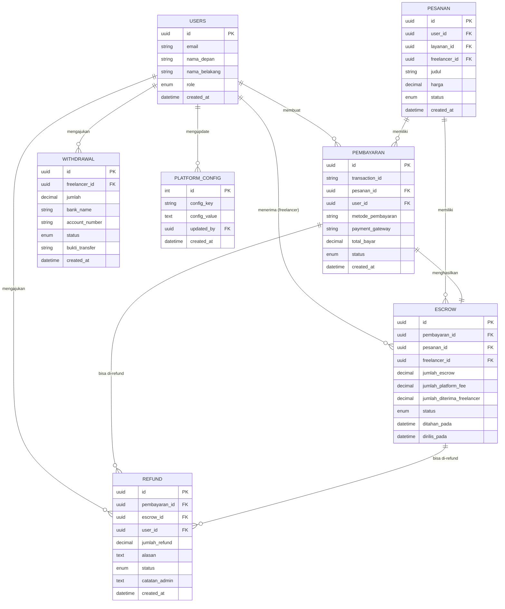

# Entity Relationship Diagram - Payment Module

## Overview
Modul pembayaran mengelola seluruh transaksi keuangan di platform SkillConnect, termasuk pembayaran, escrow, refund, dan withdrawal.

## Entities

### 1. Pembayaran (Payment)
**Table:** `pembayaran`

| Atribut | Tipe | Deskripsi |
|---------|------|-----------|
| id | UUID (PK) | Primary key |
| transaction_id | VARCHAR(255) | ID transaksi dari payment gateway |
| pesanan_id | UUID (FK) | Foreign key ke tabel pesanan |
| user_id | UUID (FK) | Foreign key ke tabel users (client) |
| metode_pembayaran | VARCHAR(50) | Metode pembayaran (e-wallet, va, credit_card) |
| payment_gateway | VARCHAR(50) | Gateway yang digunakan (midtrans, xendit, mock) |
| channel | VARCHAR(100) | Channel spesifik (gopay, bca_va, dll) |
| jumlah_pesanan | DECIMAL(10,2) | Total harga layanan |
| biaya_platform | DECIMAL(10,2) | Fee platform (%) |
| biaya_gateway | DECIMAL(10,2) | Fee payment gateway (%) |
| total_bayar | DECIMAL(10,2) | Total yang harus dibayar |
| status | ENUM | Status: menunggu, berhasil, gagal, kadaluarsa |
| payment_url | VARCHAR(255) | URL pembayaran |
| invoice_url | VARCHAR(255) | URL invoice PDF |
| dibayar_pada | DATETIME | Waktu pembayaran berhasil |
| kadaluarsa_pada | DATETIME | Waktu kadaluarsa |
| created_at | DATETIME | Waktu dibuat |
| updated_at | DATETIME | Waktu terakhir diupdate |

**Relationships:**
- `pesanan_id` → `pesanan.id` (Many-to-One)
- `user_id` → `users.id` (Many-to-One)
- One-to-One dengan `escrow`
- One-to-Many dengan `refund`

---

### 2. Escrow
**Table:** `escrow`

| Atribut | Tipe | Deskripsi |
|---------|------|-----------|
| id | UUID (PK) | Primary key |
| pembayaran_id | UUID (FK, Unique) | Foreign key ke pembayaran |
| pesanan_id | UUID (FK) | Foreign key ke pesanan |
| freelancer_id | UUID (FK) | Foreign key ke users (freelancer) |
| jumlah_escrow | DECIMAL(10,2) | Jumlah yang di-hold |
| jumlah_platform_fee | DECIMAL(10,2) | Fee platform yang dipotong |
| jumlah_diterima_freelancer | DECIMAL(10,2) | Jumlah bersih untuk freelancer |
| status | ENUM | Status: held, released, refunded, disputed, completed |
| ditahan_pada | DATETIME | Waktu dana ditahan |
| dirilis_pada | DATETIME | Waktu dana dirilis |
| created_at | DATETIME | Waktu dibuat |
| updated_at | DATETIME | Waktu terakhir diupdate |

**Relationships:**
- `pembayaran_id` → `pembayaran.id` (One-to-One)
- `pesanan_id` → `pesanan.id` (Many-to-One)
- `freelancer_id` → `users.id` (Many-to-One)

---

### 3. Refund
**Table:** `refund`

| Atribut | Tipe | Deskripsi |
|---------|------|-----------|
| id | UUID (PK) | Primary key |
| pembayaran_id | UUID (FK) | Foreign key ke pembayaran |
| escrow_id | UUID (FK) | Foreign key ke escrow |
| user_id | UUID (FK) | Foreign key ke users (client) |
| jumlah_refund | DECIMAL(10,2) | Jumlah yang di-refund |
| alasan | TEXT | Alasan refund dari client |
| status | ENUM | Status: pending, processing, completed, failed |
| transaction_id | VARCHAR(255) | ID transaksi refund |
| diproses_pada | DATETIME | Waktu diproses admin |
| selesai_pada | DATETIME | Waktu refund selesai |
| catatan_admin | TEXT | Catatan dari admin saat approve/reject |
| created_at | DATETIME | Waktu request dibuat |
| updated_at | DATETIME | Waktu terakhir diupdate |

**Relationships:**
- `pembayaran_id` → `pembayaran.id` (Many-to-One)
- `escrow_id` → `escrow.id` (Many-to-One)
- `user_id` → `users.id` (Many-to-One)

**Business Rules:**
- Refund hanya bisa diajukan untuk pembayaran dengan status 'berhasil'
- Admin approve → status 'processing' (menunggu freelancer transfer)
- Admin reject → status 'failed'
- Setelah freelancer transfer → status 'completed'

---

### 4. Withdrawal
**Table:** `withdrawal`

| Atribut | Tipe | Deskripsi |
|---------|------|-----------|
| id | UUID (PK) | Primary key |
| freelancer_id | UUID (FK) | Foreign key ke users (freelancer) |
| jumlah | DECIMAL(10,2) | Jumlah withdrawal |
| bank_name | VARCHAR(100) | Nama bank |
| account_number | VARCHAR(50) | Nomor rekening |
| account_name | VARCHAR(255) | Nama pemilik rekening |
| status | ENUM | Status: pending, processing, completed, failed |
| bukti_transfer | VARCHAR(255) | URL bukti transfer dari admin |
| catatan | TEXT | Catatan dari admin |
| diajukan_pada | DATETIME | Waktu pengajuan |
| diproses_pada | DATETIME | Waktu diproses |
| selesai_pada | DATETIME | Waktu selesai |
| created_at | DATETIME | Waktu dibuat |
| updated_at | DATETIME | Waktu terakhir diupdate |

**Relationships:**
- `freelancer_id` → `users.id` (Many-to-One)

**Business Rules:**
- Freelancer hanya bisa withdraw dari balance yang tersedia
- Balance = total escrow released - total withdrawn
- Minimum withdrawal biasanya Rp 50,000

---

### 5. Platform Config
**Table:** `platform_config`

| Atribut | Tipe | Deskripsi |
|---------|------|-----------|
| id | INT (PK, Auto-increment) | Primary key |
| config_key | VARCHAR(255, Unique) | Key konfigurasi |
| config_value | TEXT | Value konfigurasi (JSON/String) |
| description | TEXT | Deskripsi konfigurasi |
| updated_by | UUID (FK) | User yang terakhir update |
| created_at | DATETIME | Waktu dibuat |
| updated_at | DATETIME | Waktu terakhir diupdate |

**Relationships:**
- `updated_by` → `users.id` (Many-to-One)

**Config Keys:**
- `platform_fee_percentage`: Fee platform (default 5.0%)
- `payment_gateway_fee_percentage`: Fee payment gateway (default 2.5%)
- `minimum_withdrawal_amount`: Minimum withdrawal

---

## Entity Relationship Diagram (Mermaid)



---

## Database Schema SQL

```sql
-- 1. Pembayaran Table
CREATE TABLE pembayaran (
    id CHAR(36) PRIMARY KEY,
    transaction_id VARCHAR(255) UNIQUE,
    pesanan_id CHAR(36) NOT NULL,
    user_id CHAR(36) NOT NULL,
    metode_pembayaran VARCHAR(50),
    payment_gateway VARCHAR(50) DEFAULT 'midtrans',
    channel VARCHAR(100),
    jumlah_pesanan DECIMAL(10,2) NOT NULL,
    biaya_platform DECIMAL(10,2) NOT NULL DEFAULT 0,
    biaya_gateway DECIMAL(10,2) NOT NULL DEFAULT 0,
    total_bayar DECIMAL(10,2) NOT NULL,
    status ENUM('menunggu', 'berhasil', 'gagal', 'kadaluarsa') DEFAULT 'menunggu',
    payment_url VARCHAR(255),
    invoice_url VARCHAR(255),
    dibayar_pada DATETIME,
    kadaluarsa_pada DATETIME,
    created_at DATETIME DEFAULT CURRENT_TIMESTAMP,
    updated_at DATETIME DEFAULT CURRENT_TIMESTAMP ON UPDATE CURRENT_TIMESTAMP,

    FOREIGN KEY (pesanan_id) REFERENCES pesanan(id),
    FOREIGN KEY (user_id) REFERENCES users(id),
    INDEX idx_transaction_id (transaction_id),
    INDEX idx_pesanan_id (pesanan_id),
    INDEX idx_user_id (user_id),
    INDEX idx_status (status)
);

-- 2. Escrow Table
CREATE TABLE escrow (
    id CHAR(36) PRIMARY KEY,
    pembayaran_id CHAR(36) UNIQUE NOT NULL,
    pesanan_id CHAR(36) NOT NULL,
    freelancer_id CHAR(36) NOT NULL,
    jumlah_escrow DECIMAL(10,2) NOT NULL,
    jumlah_platform_fee DECIMAL(10,2) NOT NULL DEFAULT 0,
    jumlah_diterima_freelancer DECIMAL(10,2) NOT NULL,
    status ENUM('held', 'released', 'refunded', 'disputed', 'completed') DEFAULT 'held',
    ditahan_pada DATETIME,
    dirilis_pada DATETIME,
    created_at DATETIME DEFAULT CURRENT_TIMESTAMP,
    updated_at DATETIME DEFAULT CURRENT_TIMESTAMP ON UPDATE CURRENT_TIMESTAMP,

    FOREIGN KEY (pembayaran_id) REFERENCES pembayaran(id),
    FOREIGN KEY (pesanan_id) REFERENCES pesanan(id),
    FOREIGN KEY (freelancer_id) REFERENCES users(id),
    INDEX idx_pembayaran_id (pembayaran_id),
    INDEX idx_pesanan_id (pesanan_id),
    INDEX idx_freelancer_id (freelancer_id),
    INDEX idx_status (status)
);

-- 3. Refund Table
CREATE TABLE refund (
    id CHAR(36) PRIMARY KEY,
    pembayaran_id CHAR(36) NOT NULL,
    escrow_id CHAR(36) NOT NULL,
    user_id CHAR(36) NOT NULL,
    jumlah_refund DECIMAL(10,2) NOT NULL,
    alasan TEXT NOT NULL,
    status ENUM('pending', 'processing', 'completed', 'failed') DEFAULT 'pending',
    transaction_id VARCHAR(255),
    diproses_pada DATETIME,
    selesai_pada DATETIME,
    catatan_admin TEXT,
    created_at DATETIME DEFAULT CURRENT_TIMESTAMP,
    updated_at DATETIME DEFAULT CURRENT_TIMESTAMP ON UPDATE CURRENT_TIMESTAMP,

    FOREIGN KEY (pembayaran_id) REFERENCES pembayaran(id),
    FOREIGN KEY (escrow_id) REFERENCES escrow(id),
    FOREIGN KEY (user_id) REFERENCES users(id),
    INDEX idx_pembayaran_id (pembayaran_id),
    INDEX idx_user_id (user_id),
    INDEX idx_status (status)
);

-- 4. Withdrawal Table
CREATE TABLE withdrawal (
    id CHAR(36) PRIMARY KEY,
    freelancer_id CHAR(36) NOT NULL,
    jumlah DECIMAL(10,2) NOT NULL,
    bank_name VARCHAR(100) NOT NULL,
    account_number VARCHAR(50) NOT NULL,
    account_name VARCHAR(255) NOT NULL,
    status ENUM('pending', 'processing', 'completed', 'failed') DEFAULT 'pending',
    bukti_transfer VARCHAR(255),
    catatan TEXT,
    diajukan_pada DATETIME,
    diproses_pada DATETIME,
    selesai_pada DATETIME,
    created_at DATETIME DEFAULT CURRENT_TIMESTAMP,
    updated_at DATETIME DEFAULT CURRENT_TIMESTAMP ON UPDATE CURRENT_TIMESTAMP,

    FOREIGN KEY (freelancer_id) REFERENCES users(id),
    INDEX idx_freelancer_id (freelancer_id),
    INDEX idx_status (status)
);

-- 5. Platform Config Table
CREATE TABLE platform_config (
    id INT AUTO_INCREMENT PRIMARY KEY,
    config_key VARCHAR(255) UNIQUE NOT NULL,
    config_value TEXT NOT NULL,
    description TEXT,
    updated_by CHAR(36),
    created_at DATETIME DEFAULT CURRENT_TIMESTAMP,
    updated_at DATETIME DEFAULT CURRENT_TIMESTAMP ON UPDATE CURRENT_TIMESTAMP,

    FOREIGN KEY (updated_by) REFERENCES users(id),
    INDEX idx_config_key (config_key)
);
```

---

## Workflow Diagrams

### 1. Payment Flow
```
Client → Create Order → Create Payment → Payment Gateway → Webhook
                                                               ↓
                                                        Update Status
                                                               ↓
                                              [Berhasil] → Create Escrow
                                              [Gagal/Expired] → Mark as Failed
```

### 2. Escrow Flow
```
Payment Success → Create Escrow (status: held)
                        ↓
                  Order Completed by Client
                        ↓
                  Release Escrow (status: released)
                        ↓
                  Add to Freelancer Balance
```

### 3. Refund Flow
```
Client → Request Refund (status: pending)
              ↓
        Admin Reviews
              ↓
    [Approve] → status: processing → Freelancer Transfers → status: completed
              ↓
    [Reject]  → status: failed
```

### 4. Withdrawal Flow
```
Freelancer → Request Withdrawal (status: pending)
                   ↓
             Admin Reviews
                   ↓
    [Approve] → Upload Bukti Transfer → status: completed
                   ↓
    [Reject]  → status: failed
```

---

## Business Rules

### Payment
1. Payment harus terhubung dengan Order yang valid
2. Total bayar = jumlah_pesanan + biaya_platform + biaya_gateway
3. Payment expired setelah 24 jam jika tidak dibayar
4. Satu order hanya bisa memiliki satu payment yang berhasil

### Escrow
1. Escrow otomatis dibuat saat payment berhasil
2. Jumlah escrow = total_bayar - biaya_gateway
3. Platform fee dipotong dari escrow saat release
4. Escrow hanya bisa dirilis oleh client setelah order selesai
5. Admin bisa intervensi untuk dispute

### Refund
1. Refund hanya bisa diajukan untuk payment yang berhasil
2. Jumlah refund = total yang dibayarkan (full refund)
3. Admin harus approve/reject refund request
4. Jika approved, freelancer yang harus transfer kembali ke client
5. Status 'processing' menunggu konfirmasi transfer dari freelancer

### Withdrawal
1. Minimum withdrawal amount (configureable via platform_config)
2. Freelancer balance = total escrow released - total withdrawn
3. Admin harus upload bukti transfer saat approve
4. Withdrawal bisa ditolak jika data rekening tidak valid

### Platform Config
1. Fee platform dan gateway bisa diubah oleh admin
2. Perubahan fee hanya berlaku untuk transaksi baru
3. Transaksi lama tetap menggunakan fee saat transaksi dibuat

---

## Indexes untuk Performance

```sql
-- Payment indexes
CREATE INDEX idx_payment_status_created ON pembayaran(status, created_at DESC);
CREATE INDEX idx_payment_user_status ON pembayaran(user_id, status);

-- Escrow indexes
CREATE INDEX idx_escrow_freelancer_status ON escrow(freelancer_id, status);
CREATE INDEX idx_escrow_status_created ON escrow(status, created_at DESC);

-- Refund indexes
CREATE INDEX idx_refund_status_created ON refund(status, created_at DESC);

-- Withdrawal indexes
CREATE INDEX idx_withdrawal_freelancer_status ON withdrawal(freelancer_id, status);
CREATE INDEX idx_withdrawal_status_created ON withdrawal(status, created_at DESC);
```

---

## Notes
- Semua ID menggunakan UUID untuk keamanan dan distributed system
- Timestamps (created_at, updated_at) otomatis dikelola database
- ENUM values untuk status membatasi nilai yang valid
- Foreign keys memastikan referential integrity
- Indexes dioptimalkan untuk query yang sering digunakan
