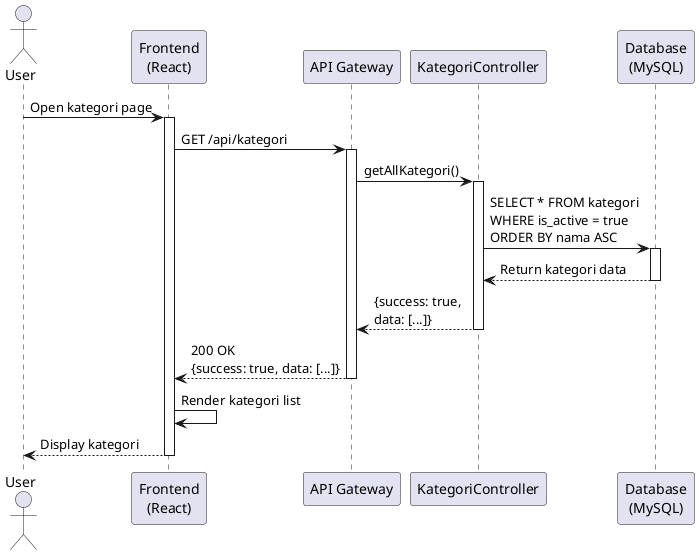
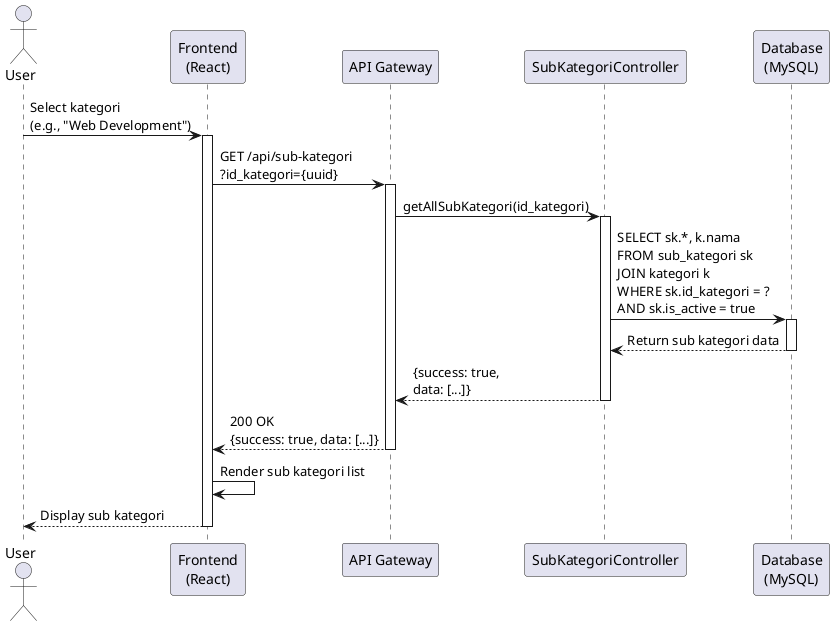
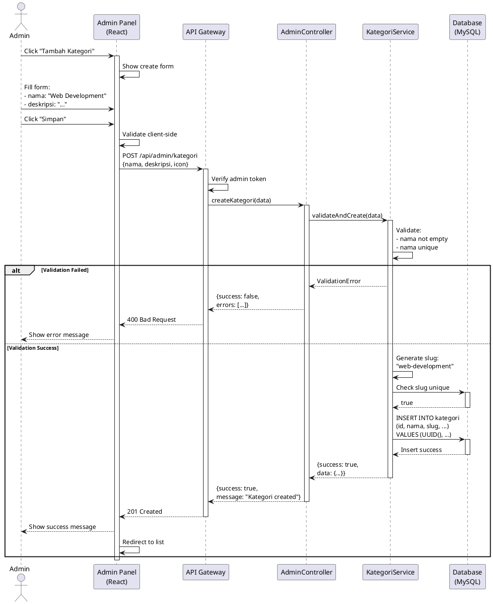
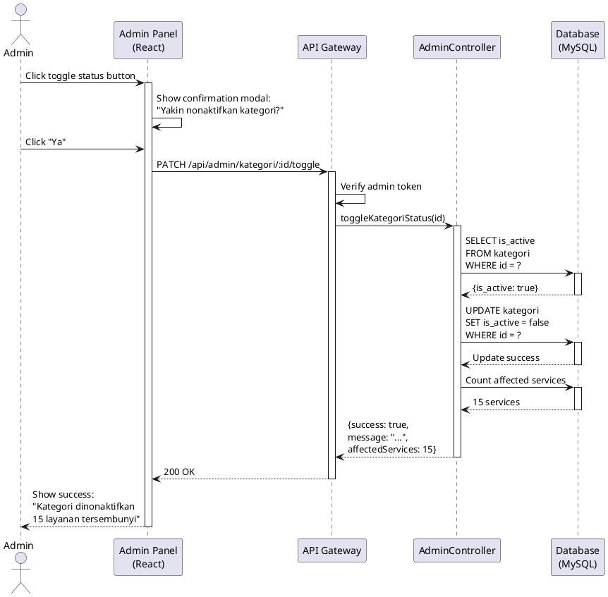
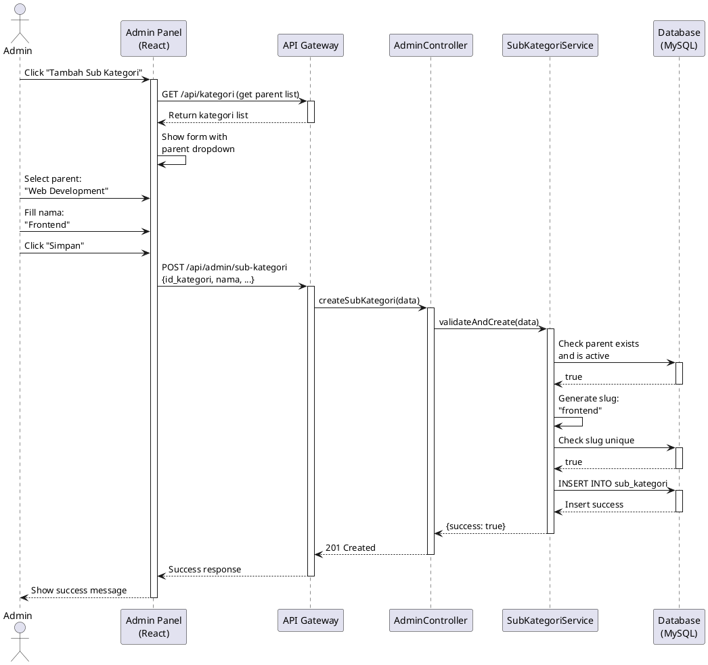
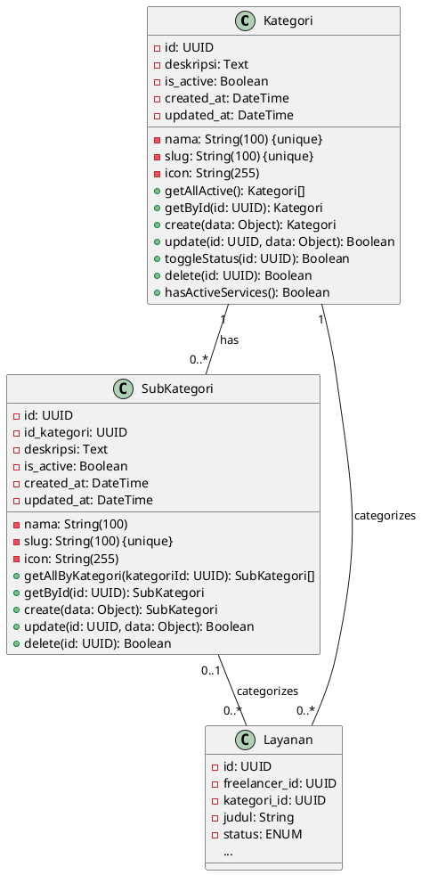

# Modul Kategori & Sub Kategori Management

**Version:** 1.0
**Last Updated:** November 10, 2025
**Status:** In Development

---

## Table of Contents

1. [Overview](#overview)
2. [User Stories](#user-stories)
3. [Use Case Diagram](#use-case-diagram)
4. [Use Case Specifications](#use-case-specifications)
5. [Use Case Realization (Sequence Diagrams)](#use-case-realization-sequence-diagrams)
6. [Class Diagram](#class-diagram)
7. [Database Schema](#database-schema)
8. [API Endpoints](#api-endpoints)
9. [Implementation Status](#implementation-status)

---

## Overview

Modul Kategori & Sub Kategori merupakan sistem manajemen kategorisasi layanan dalam platform Skill Connect. Modul ini memungkinkan:

- **User (Client/Freelancer):** Melihat dan memfilter layanan berdasarkan kategori
- **Admin:** Mengelola kategori dan sub kategori (CRUD operations)
- **System:** Mengorganisir layanan dalam struktur hierarki kategori

### Key Features

- ✅ View active categories (User)
- ✅ View sub categories (User)
- 🔄 Filter services by category (In Development)
- 🔄 CRUD operations for categories (Admin) (In Development)
- 🔄 CRUD operations for sub categories (Admin) (In Development)
- 📋 Category statistics and reporting (Planned)

---

## User Stories

### US-KAT-001: Melihat Daftar Kategori (User - Client/Freelancer)

**As a** user (client atau freelancer)
**I want to** melihat daftar kategori layanan yang tersedia
**So that** saya bisa memilih kategori yang sesuai dengan kebutuhan saya

**Acceptance Criteria:**
- ✅ User dapat melihat semua kategori aktif
- ✅ Setiap kategori menampilkan nama, slug, deskripsi, dan icon
- ✅ Kategori ditampilkan dalam urutan alfabetis
- ✅ Hanya kategori dengan status `is_active = true` yang ditampilkan

**Priority:** High
**Story Points:** 3
**Status:** ✅ Implemented

**Implementation:**
```javascript
// Endpoint: GET /api/kategori
// Controller: KategoriController.getAllKategori()
```

---

### US-KAT-002: Melihat Daftar Sub Kategori (User - Client/Freelancer)

**As a** user (client atau freelancer)
**I want to** melihat daftar sub kategori dari kategori yang dipilih
**So that** saya bisa mencari layanan yang lebih spesifik

**Acceptance Criteria:**
- ✅ User dapat melihat sub kategori setelah memilih kategori utama
- ✅ Sub kategori ditampilkan sesuai dengan kategori parent-nya
- ✅ Menampilkan nama kategori parent pada setiap sub kategori
- ✅ Sub kategori diurutkan berdasarkan nama kategori, lalu nama sub kategori

**Priority:** High
**Story Points:** 3
**Status:** ✅ Implemented

**Implementation:**
```javascript
// Endpoint: GET /api/sub-kategori?id_kategori={uuid}
// Controller: SubKategoriController.getAllSubKategori()
```

---

### US-KAT-003: Filter Layanan Berdasarkan Kategori (User - Client)

**As a** client
**I want to** memfilter layanan berdasarkan kategori
**So that** saya bisa menemukan layanan yang sesuai dengan kebutuhan saya

**Acceptance Criteria:**
- Client dapat memilih kategori dari dropdown/menu
- Sistem menampilkan semua layanan yang termasuk dalam kategori tersebut
- Filter dapat dikombinasikan dengan filter lainnya (harga, rating, dll)
- Menampilkan jumlah layanan yang tersedia di kategori tersebut

**Priority:** High
**Story Points:** 5
**Status:** 🔄 In Development

---

### US-KAT-004: Membuat Kategori Baru (Admin)

**As an** admin
**I want to** membuat kategori baru
**So that** freelancer dapat mengkategorikan layanan mereka dengan lebih baik

**Acceptance Criteria:**
- Admin dapat mengakses form pembuatan kategori
- Form memiliki field: nama, slug (auto-generate), deskripsi, icon URL
- Slug harus unique
- Nama kategori harus unique
- Sistem melakukan validasi input
- Kategori baru otomatis set sebagai aktif
- Admin menerima konfirmasi setelah berhasil membuat kategori

**Priority:** High
**Story Points:** 5
**Status:** 📋 Planned

**Proposed API:**
```javascript
POST /api/admin/kategori
Content-Type: application/json
Authorization: Bearer {admin_token}

{
  "nama": "Web Development",
  "deskripsi": "Build and maintain websites",
  "icon": "https://example.com/icon.png"
}
```

---

### US-KAT-005: Mengubah Kategori (Admin)

**As an** admin
**I want to** mengubah informasi kategori yang sudah ada
**So that** saya dapat memperbaiki atau memperbarui informasi kategori

**Acceptance Criteria:**
- Admin dapat memilih kategori yang akan diubah
- Form edit menampilkan data kategori yang sudah ada
- Admin dapat mengubah nama, deskripsi, dan icon
- Slug tidak dapat diubah untuk menjaga konsistensi URL
- Validasi unique untuk nama kategori
- Perubahan tersimpan ke database
- Admin menerima konfirmasi setelah berhasil mengubah

**Priority:** Medium
**Story Points:** 5
**Status:** 📋 Planned

---

### US-KAT-006: Menonaktifkan/Mengaktifkan Kategori (Admin)

**As an** admin
**I want to** menonaktifkan atau mengaktifkan kategori
**So that** saya dapat mengontrol kategori mana yang visible untuk user

**Acceptance Criteria:**
- Admin dapat toggle status aktif/nonaktif kategori
- Kategori yang nonaktif tidak muncul di daftar kategori user
- Sub kategori dari kategori yang nonaktif juga ikut tersembunyi
- Layanan dalam kategori nonaktif tidak dapat dilihat user (kecuali admin)
- Sistem menampilkan konfirmasi sebelum menonaktifkan
- Menampilkan warning jika ada layanan aktif dalam kategori tersebut

**Priority:** Medium
**Story Points:** 5
**Status:** 📋 Planned

---

### US-KAT-007: Menghapus Kategori (Admin)

**As an** admin
**I want to** menghapus kategori yang tidak digunakan
**So that** sistem tetap terorganisir dan tidak ada kategori yang tidak relevan

**Acceptance Criteria:**
- Admin dapat menghapus kategori yang tidak memiliki layanan
- Sistem mencegah penghapusan kategori yang memiliki layanan aktif
- Sistem menampilkan konfirmasi sebelum menghapus
- Penghapusan kategori akan menghapus semua sub kategori-nya (CASCADE)
- Admin menerima notifikasi setelah berhasil menghapus

**Priority:** Low
**Story Points:** 3
**Status:** 📋 Planned

---

### US-KAT-008: Membuat Sub Kategori (Admin)

**As an** admin
**I want to** membuat sub kategori di bawah kategori tertentu
**So that** layanan dapat dikategorikan lebih spesifik

**Acceptance Criteria:**
- Admin dapat memilih kategori parent
- Form memiliki field: nama, slug (auto-generate), deskripsi, icon, kategori parent
- Slug harus unique secara global
- Nama sub kategori tidak harus unique (boleh sama di kategori berbeda)
- Sub kategori baru otomatis aktif
- Admin menerima konfirmasi setelah berhasil

**Priority:** High
**Story Points:** 5
**Status:** 📋 Planned

---

### US-KAT-009: Mengubah Sub Kategori (Admin)

**As an** admin
**I want to** mengubah informasi sub kategori
**So that** saya dapat memperbaiki atau memperbarui informasi

**Acceptance Criteria:**
- Admin dapat memilih sub kategori yang akan diubah
- Admin dapat mengubah nama, deskripsi, icon, dan kategori parent
- Validasi unique untuk slug
- Perubahan tersimpan ke database
- Jika kategori parent diubah, semua layanan di sub kategori tersebut ikut berpindah

**Priority:** Medium
**Story Points:** 5
**Status:** 📋 Planned

---

### US-KAT-010: Melihat Statistik Kategori (Admin)

**As an** admin
**I want to** melihat statistik penggunaan kategori
**So that** saya dapat mengetahui kategori mana yang paling populer

**Acceptance Criteria:**
- Admin dapat melihat jumlah layanan per kategori
- Menampilkan jumlah pesanan per kategori
- Menampilkan rata-rata rating per kategori
- Data dapat diexport dalam format CSV/Excel
- Data ditampilkan dalam bentuk tabel dan chart

**Priority:** Low
**Story Points:** 8
**Status:** 📋 Planned

---

## Use Case Diagram

```plantuml
@startuml Kategori_Use_Case_Diagram

left to right direction
skinparam actorStyle awesome

actor "User\n(Client/Freelancer)" as User
actor "Admin" as Admin

rectangle "Kategori Management System" {
  ' User Use Cases
  usecase "UC-KAT-001\nView Categories" as UC1
  usecase "UC-KAT-002\nView Sub Categories" as UC2
  usecase "UC-KAT-003\nFilter Services by Category" as UC3

  ' Admin Use Cases - Kategori
  usecase "UC-KAT-004\nCreate Category" as UC4
  usecase "UC-KAT-005\nUpdate Category" as UC5
  usecase "UC-KAT-006\nToggle Category Status" as UC6
  usecase "UC-KAT-007\nDelete Category" as UC7

  ' Admin Use Cases - Sub Kategori
  usecase "UC-KAT-008\nCreate Sub Category" as UC8
  usecase "UC-KAT-009\nUpdate Sub Category" as UC9
  usecase "UC-KAT-010\nDelete Sub Category" as UC10

  ' Admin Use Cases - Statistics
  usecase "UC-KAT-011\nView Category Statistics" as UC11
  usecase "UC-KAT-012\nExport Category Report" as UC12

  ' Include relationships
  UC4 ..> UC4_Validate : <<include>>
  UC5 ..> UC4_Validate : <<include>>
  UC8 ..> UC8_Validate : <<include>>

  usecase "Validate Category Data" as UC4_Validate
  usecase "Validate Sub Category Data" as UC8_Validate

  ' Extend relationships
  UC7 ..> UC7_Check : <<extend>>
  UC10 ..> UC10_Check : <<extend>>

  usecase "Check for Active Services" as UC7_Check
  usecase "Check for Dependencies" as UC10_Check
}

' User relationships
User --> UC1
User --> UC2
User --> UC3

' Admin relationships (inherits from User)
Admin --|> User
Admin --> UC4
Admin --> UC5
Admin --> UC6
Admin --> UC7
Admin --> UC8
Admin --> UC9
Admin --> UC10
Admin --> UC11
Admin --> UC12

@enduml
```

---

## Use Case Specifications

### UC-KAT-001: View Categories

**Actor:** User (Client/Freelancer)
**Goal:** Melihat daftar kategori layanan yang tersedia
**Preconditions:** User mengakses aplikasi
**Postconditions:** Daftar kategori ditampilkan
**Status:** ✅ Implemented

#### Main Flow:
1. User membuka halaman kategori atau landing page
2. System mengambil semua kategori aktif dari database
3. System mengurutkan kategori berdasarkan nama (A-Z)
4. System menampilkan kategori dengan nama, icon, dan deskripsi
5. Use case selesai

#### Alternative Flow:
**2a. Tidak ada kategori aktif**
- System menampilkan pesan "Belum ada kategori tersedia"
- Use case selesai

#### Exception Flow:
**2b. Database error**
- System menampilkan error message
- Use case selesai

#### Implementation Details:
```javascript
// File: backend/src/modules/service/presentation/controllers/KategoriController.js
async getAllKategori(req, res) {
  try {
    const [results] = await this.sequelize.query(
      'SELECT id, nama, slug, deskripsi, icon FROM kategori WHERE is_active = true ORDER BY nama ASC'
    );

    res.status(200).json({
      success: true,
      data: results
    });
  } catch (error) {
    res.status(500).json({
      success: false,
      message: 'Failed to fetch categories',
      error: error.message
    });
  }
}
```

---

### UC-KAT-002: View Sub Categories

**Actor:** User (Client/Freelancer)
**Goal:** Melihat daftar sub kategori dari kategori tertentu
**Preconditions:** User memilih kategori
**Postconditions:** Daftar sub kategori ditampilkan
**Status:** ✅ Implemented

#### Main Flow:
1. User memilih kategori tertentu
2. System menerima parameter `id_kategori`
3. System mengambil semua sub kategori yang aktif dari kategori tersebut
4. System join dengan tabel kategori untuk mendapatkan nama kategori
5. System mengurutkan berdasarkan nama kategori dan nama sub kategori
6. System menampilkan daftar sub kategori
7. Use case selesai

#### Alternative Flow:
**3a. Tidak ada sub kategori untuk kategori tersebut**
- System menampilkan empty list atau pesan informatif
- Use case selesai

**2a. Parameter id_kategori tidak disediakan**
- System menampilkan semua sub kategori dari semua kategori
- Use case continue ke step 3

---

### UC-KAT-004: Create Category (Admin)

**Actor:** Admin
**Goal:** Membuat kategori baru
**Preconditions:**
- Admin sudah login
- Admin memiliki akses ke admin panel

**Postconditions:** Kategori baru tersimpan di database
**Status:** 📋 Planned

#### Main Flow:
1. Admin mengakses halaman kategori management
2. Admin menekan tombol "Tambah Kategori"
3. System menampilkan form input kategori
4. Admin mengisi:
   - Nama kategori (required)
   - Deskripsi (optional)
   - Icon URL (optional)
5. Admin menekan tombol "Simpan"
6. System melakukan validasi (<<include>> Validate Category Data):
   - Nama tidak boleh kosong
   - Nama harus unique
   - Generate slug dari nama (lowercase, replace spaces with dash)
   - Slug harus unique
7. System menyimpan data ke table `kategori` dengan:
   - id: UUID auto-generated
   - nama: input dari admin
   - slug: auto-generated
   - deskripsi: input dari admin
   - icon: input dari admin
   - is_active: true (default)
   - created_at: current timestamp
   - updated_at: current timestamp
8. System menampilkan success message
9. System redirect ke halaman daftar kategori
10. Use case selesai

#### Alternative Flow:
**6a. Validasi gagal**
- System menampilkan error message yang spesifik
- System tetap di form dengan data yang sudah diisi
- Use case kembali ke step 4

#### Exception Flow:
**7a. Database error saat menyimpan**
- System menampilkan error message
- System rollback transaction
- Use case kembali ke step 4

---

### UC-KAT-006: Toggle Category Status (Admin)

**Actor:** Admin
**Goal:** Mengaktifkan atau menonaktifkan kategori
**Preconditions:**
- Admin sudah login
- Kategori sudah ada di database

**Postconditions:** Status kategori berubah
**Status:** 📋 Planned

#### Main Flow:
1. Admin mengakses halaman kategori management
2. System menampilkan daftar kategori dengan status aktif/nonaktif
3. Admin memilih kategori yang akan diubah statusnya
4. Admin menekan toggle button "Aktif/Nonaktif"
5. System menampilkan konfirmasi:
   - Jika akan nonaktifkan: "Yakin ingin menonaktifkan kategori ini? Sub kategori dan layanan di dalamnya akan tersembunyi."
   - Jika akan aktifkan: "Yakin ingin mengaktifkan kategori ini?"
6. Admin menekan "Ya"
7. System mengubah field `is_active` di database
8. System menghitung jumlah layanan yang terpengaruh
9. System menampilkan success message dengan info layanan yang tersembunyi/ditampilkan
10. System refresh daftar kategori
11. Use case selesai

#### Alternative Flow:
**6a. Admin membatalkan**
- System tidak melakukan perubahan
- Use case selesai

#### Exception Flow:
**7a. Database error**
- System menampilkan error message
- Status tidak berubah
- Use case selesai

---

### UC-KAT-008: Create Sub Category (Admin)

**Actor:** Admin
**Goal:** Membuat sub kategori baru
**Preconditions:**
- Admin sudah login
- Minimal ada 1 kategori aktif

**Postconditions:** Sub kategori baru tersimpan di database
**Status:** 📋 Planned

#### Main Flow:
1. Admin mengakses halaman sub kategori management
2. Admin menekan tombol "Tambah Sub Kategori"
3. System menampilkan form input dengan dropdown kategori parent
4. Admin mengisi:
   - Kategori parent (required, dropdown)
   - Nama sub kategori (required)
   - Deskripsi (optional)
   - Icon URL (optional)
5. Admin menekan tombol "Simpan"
6. System melakukan validasi (<<include>> Validate Sub Category Data):
   - Kategori parent harus dipilih
   - Nama tidak boleh kosong
   - Generate slug dari nama
   - Slug harus unique secara global
7. System menyimpan data ke table `sub_kategori`
8. System menampilkan success message
9. System redirect ke halaman daftar sub kategori
10. Use case selesai

#### Alternative Flow:
**3a. Tidak ada kategori aktif**
- System menampilkan pesan "Buat kategori terlebih dahulu"
- System redirect ke halaman kategori management
- Use case selesai

---

## Use Case Realization (Sequence Diagrams)

### SR-KAT-001: View Categories



**Expected Response:**
```json
{
  "success": true,
  "data": [
    {
      "id": "d6ac872b-a155-44b0-b948-2b50e779378e",
      "nama": "Copy Writing",
      "slug": "copy-writing",
      "deskripsi": "Penulisan konten kreatif dan persuasif untuk berbagai kebutuhan marketing",
      "icon": null
    },
    {
      "id": "eb094a17-f75b-4c07-8652-345907849ab7",
      "nama": "Pengembangan Website",
      "slug": "pengembangan-website",
      "deskripsi": "Layanan pengembangan website profesional untuk berbagai kebutuhan bisnis",
      "icon": null
    }
  ]
}
```

---

### SR-KAT-002: View Sub Categories



---

### SR-KAT-004: Create Category (Planned)



---

### SR-KAT-006: Toggle Category Status (Planned)



---

### SR-KAT-008: Create Sub Category (Planned)



---

## Class Diagram



---

## Database Schema

### Table: `kategori`

```sql
CREATE TABLE kategori (
  id UUID PRIMARY KEY DEFAULT UUID(),
  nama VARCHAR(100) NOT NULL UNIQUE COMMENT 'Nama kategori (unique)',
  slug VARCHAR(100) NOT NULL UNIQUE COMMENT 'Slug untuk URL (unique)',
  deskripsi TEXT COMMENT 'Deskripsi kategori',
  icon VARCHAR(255) COMMENT 'URL icon kategori',
  is_active BOOLEAN NOT NULL DEFAULT true COMMENT 'Status aktif/nonaktif',
  created_at TIMESTAMP NOT NULL DEFAULT CURRENT_TIMESTAMP,
  updated_at TIMESTAMP NOT NULL DEFAULT CURRENT_TIMESTAMP ON UPDATE CURRENT_TIMESTAMP,

  INDEX idx_slug (slug),
  INDEX idx_is_active (is_active),
  INDEX idx_nama (nama)
) ENGINE=InnoDB DEFAULT CHARSET=utf8mb4 COLLATE=utf8mb4_unicode_ci;
```

**Fields:**
| Field | Type | Null | Key | Default | Description |
|-------|------|------|-----|---------|-------------|
| id | UUID | NO | PRI | UUID() | Primary key |
| nama | VARCHAR(100) | NO | UNI | - | Nama kategori (unique) |
| slug | VARCHAR(100) | NO | UNI | - | URL-friendly identifier |
| deskripsi | TEXT | YES | - | NULL | Deskripsi kategori |
| icon | VARCHAR(255) | YES | - | NULL | URL icon kategori |
| is_active | BOOLEAN | NO | MUL | true | Status aktif/nonaktif |
| created_at | TIMESTAMP | NO | - | CURRENT_TIMESTAMP | Waktu dibuat |
| updated_at | TIMESTAMP | NO | - | CURRENT_TIMESTAMP | Waktu update terakhir |

**Indexes:**
- PRIMARY KEY (`id`)
- UNIQUE KEY `nama` (`nama`)
- UNIQUE KEY `slug` (`slug`)
- INDEX `idx_is_active` (`is_active`)

---

### Table: `sub_kategori`

```sql
CREATE TABLE sub_kategori (
  id UUID PRIMARY KEY DEFAULT UUID(),
  id_kategori UUID NOT NULL COMMENT 'Foreign key ke tabel kategori',
  nama VARCHAR(100) NOT NULL COMMENT 'Nama sub kategori',
  slug VARCHAR(100) NOT NULL UNIQUE COMMENT 'Slug untuk URL (unique)',
  deskripsi TEXT COMMENT 'Deskripsi sub kategori',
  icon VARCHAR(255) COMMENT 'URL icon sub kategori',
  is_active BOOLEAN NOT NULL DEFAULT true COMMENT 'Status aktif/nonaktif',
  created_at TIMESTAMP NOT NULL DEFAULT CURRENT_TIMESTAMP,
  updated_at TIMESTAMP NOT NULL DEFAULT CURRENT_TIMESTAMP ON UPDATE CURRENT_TIMESTAMP,

  FOREIGN KEY (id_kategori) REFERENCES kategori(id) ON DELETE CASCADE ON UPDATE CASCADE,
  INDEX idx_slug (slug),
  INDEX idx_kategori (id_kategori),
  INDEX idx_is_active (is_active)
) ENGINE=InnoDB DEFAULT CHARSET=utf8mb4 COLLATE=utf8mb4_unicode_ci;
```

**Fields:**
| Field | Type | Null | Key | Default | Description |
|-------|------|------|-----|---------|-------------|
| id | UUID | NO | PRI | UUID() | Primary key |
| id_kategori | UUID | NO | FOR | - | Foreign key ke kategori |
| nama | VARCHAR(100) | NO | - | - | Nama sub kategori |
| slug | VARCHAR(100) | NO | UNI | - | URL-friendly identifier |
| deskripsi | TEXT | YES | - | NULL | Deskripsi sub kategori |
| icon | VARCHAR(255) | YES | - | NULL | URL icon sub kategori |
| is_active | BOOLEAN | NO | MUL | true | Status aktif/nonaktif |
| created_at | TIMESTAMP | NO | - | CURRENT_TIMESTAMP | Waktu dibuat |
| updated_at | TIMESTAMP | NO | - | CURRENT_TIMESTAMP | Waktu update terakhir |

**Indexes:**
- PRIMARY KEY (`id`)
- UNIQUE KEY `slug` (`slug`)
- FOREIGN KEY (`id_kategori`) REFERENCES `kategori`(`id`) ON DELETE CASCADE
- INDEX `idx_kategori` (`id_kategori`)
- INDEX `idx_is_active` (`is_active`)

**Relationships:**
- `sub_kategori.id_kategori` → `kategori.id` (CASCADE on delete)

---

### Sample Data

**Current Categories (Production):**
```sql
-- 6 active categories
INSERT INTO kategori (id, nama, slug, deskripsi) VALUES
('d6ac872b-a155-44b0-b948-2b50e779378e', 'Copy Writing', 'copy-writing', 'Penulisan konten kreatif dan persuasif untuk berbagai kebutuhan marketing'),
('d347ce69-0f3c-4db6-a2d3-931f3782a63a', 'Cybersecurity & Testing', 'cybersecurity-testing', 'Layanan keamanan siber dan pengujian aplikasi untuk melindungi sistem Anda'),
('183aa356-067f-4ed4-9020-ddd975bdcc6b', 'Data Science & Machine Learning', 'data-science-machine-learning', 'Analisis data dan implementasi machine learning untuk solusi bisnis cerdas'),
('9ccd23bc-ceaf-4ae8-863c-f321c9bb81db', 'Pengembangan Aplikasi Mobile', 'pengembangan-aplikasi-mobile', 'Pembuatan aplikasi mobile Android dan iOS yang inovatif dan user-friendly'),
('eb094a17-f75b-4c07-8652-345907849ab7', 'Pengembangan Website', 'pengembangan-website', 'Layanan pengembangan website profesional untuk berbagai kebutuhan bisnis'),
('26d06915-ed71-445e-ac6a-31b0191671d7', 'UI/UX Design', 'ui-ux-design', 'Desain antarmuka dan pengalaman pengguna yang menarik dan intuitif');
```

---

## API Endpoints

### Public Endpoints (User Access)

#### 1. Get All Categories

**Endpoint:** `GET /api/kategori`
**Authentication:** Not required
**Status:** ✅ Implemented

**Description:**
Retrieve list of all active service categories

**Parameters:**
None

**Success Response (200 OK):**
```json
{
  "success": true,
  "data": [
    {
      "id": "123e4567-e89b-12d3-a456-426614174000",
      "nama": "Web Development",
      "slug": "web-development",
      "deskripsi": "Build and maintain websites and web applications",
      "icon": "code"
    }
  ]
}
```

**Error Response (500 Internal Server Error):**
```json
{
  "success": false,
  "message": "Failed to fetch categories",
  "error": "Database connection error"
}
```

**Example Request:**
```bash
curl -X 'GET' \
  'https://api-ppl.vinmedia.my.id/api/kategori' \
  -H 'accept: application/json'
```

---

#### 2. Get All Sub Categories

**Endpoint:** `GET /api/sub-kategori`
**Authentication:** Not required
**Status:** ✅ Implemented

**Description:**
Retrieve list of all sub categories, optionally filtered by parent category

**Query Parameters:**
| Parameter | Type | Required | Description |
|-----------|------|----------|-------------|
| id_kategori | UUID | No | Filter by parent category ID |

**Success Response (200 OK):**
```json
{
  "success": true,
  "data": [
    {
      "id": "456e7890-e89b-12d3-a456-426614174001",
      "id_kategori": "123e4567-e89b-12d3-a456-426614174000",
      "nama": "Frontend Development",
      "slug": "frontend-development",
      "deskripsi": "HTML, CSS, JavaScript frameworks",
      "icon": "frontend-icon",
      "nama_kategori": "Web Development",
      "kategori_slug": "web-development"
    }
  ]
}
```

**Example Request:**
```bash
# Get all sub categories
curl -X 'GET' \
  'https://api-ppl.vinmedia.my.id/api/sub-kategori' \
  -H 'accept: application/json'

# Get sub categories by parent
curl -X 'GET' \
  'https://api-ppl.vinmedia.my.id/api/sub-kategori?id_kategori=123e4567-e89b-12d3-a456-426614174000' \
  -H 'accept: application/json'
```

---

#### 3. Get Sub Category by ID

**Endpoint:** `GET /api/sub-kategori/:id`
**Authentication:** Not required
**Status:** ✅ Implemented

**Description:**
Get details of a specific sub category

**Path Parameters:**
| Parameter | Type | Required | Description |
|-----------|------|----------|-------------|
| id | UUID | Yes | Sub category ID |

**Success Response (200 OK):**
```json
{
  "success": true,
  "data": {
    "id": "456e7890-e89b-12d3-a456-426614174001",
    "id_kategori": "123e4567-e89b-12d3-a456-426614174000",
    "nama": "Frontend Development",
    "slug": "frontend-development",
    "deskripsi": "HTML, CSS, JavaScript frameworks",
    "icon": "frontend-icon",
    "nama_kategori": "Web Development",
    "kategori_slug": "web-development"
  }
}
```

**Error Response (404 Not Found):**
```json
{
  "success": false,
  "message": "Sub category not found"
}
```

---

### Admin Endpoints (Planned)

#### 4. Create Category

**Endpoint:** `POST /api/admin/kategori`
**Authentication:** Required (Admin only)
**Status:** 📋 Planned

**Description:**
Create a new category

**Request Headers:**
```
Authorization: Bearer {admin_token}
Content-Type: application/json
```

**Request Body:**
```json
{
  "nama": "Web Development",
  "deskripsi": "Build and maintain websites and web applications",
  "icon": "https://example.com/icons/web-dev.png"
}
```

**Validation Rules:**
- `nama`: Required, unique, max 100 characters
- `deskripsi`: Optional, text
- `icon`: Optional, valid URL, max 255 characters

**Success Response (201 Created):**
```json
{
  "success": true,
  "message": "Category created successfully",
  "data": {
    "id": "123e4567-e89b-12d3-a456-426614174000",
    "nama": "Web Development",
    "slug": "web-development",
    "deskripsi": "Build and maintain websites and web applications",
    "icon": "https://example.com/icons/web-dev.png",
    "is_active": true,
    "created_at": "2025-11-10T12:00:00Z"
  }
}
```

**Error Response (400 Bad Request):**
```json
{
  "success": false,
  "message": "Validation failed",
  "errors": [
    {
      "field": "nama",
      "message": "Category name already exists"
    }
  ]
}
```

---

#### 5. Update Category

**Endpoint:** `PUT /api/admin/kategori/:id`
**Authentication:** Required (Admin only)
**Status:** 📋 Planned

**Description:**
Update an existing category

**Path Parameters:**
| Parameter | Type | Required | Description |
|-----------|------|----------|-------------|
| id | UUID | Yes | Category ID |

**Request Body:**
```json
{
  "nama": "Web Development & Design",
  "deskripsi": "Updated description",
  "icon": "https://example.com/icons/web-dev-new.png"
}
```

**Note:** Slug cannot be updated to maintain URL consistency

**Success Response (200 OK):**
```json
{
  "success": true,
  "message": "Category updated successfully",
  "data": {
    "id": "123e4567-e89b-12d3-a456-426614174000",
    "nama": "Web Development & Design",
    "slug": "web-development",
    "deskripsi": "Updated description",
    "icon": "https://example.com/icons/web-dev-new.png",
    "is_active": true,
    "updated_at": "2025-11-10T13:00:00Z"
  }
}
```

---

#### 6. Toggle Category Status

**Endpoint:** `PATCH /api/admin/kategori/:id/toggle`
**Authentication:** Required (Admin only)
**Status:** 📋 Planned

**Description:**
Activate or deactivate a category

**Path Parameters:**
| Parameter | Type | Required | Description |
|-----------|------|----------|-------------|
| id | UUID | Yes | Category ID |

**Request Body:**
```json
{
  "reason": "Category no longer relevant" // Optional, for audit log
}
```

**Success Response (200 OK):**
```json
{
  "success": true,
  "message": "Category status updated successfully",
  "data": {
    "id": "123e4567-e89b-12d3-a456-426614174000",
    "is_active": false,
    "affectedServices": 15,
    "affectedSubCategories": 3
  }
}
```

**Note:** Deactivating a category will hide all sub categories and services under it

---

#### 7. Delete Category

**Endpoint:** `DELETE /api/admin/kategori/:id`
**Authentication:** Required (Admin only)
**Status:** 📋 Planned

**Description:**
Delete a category (only if no active services)

**Path Parameters:**
| Parameter | Type | Required | Description |
|-----------|------|----------|-------------|
| id | UUID | Yes | Category ID |

**Success Response (200 OK):**
```json
{
  "success": true,
  "message": "Category deleted successfully"
}
```

**Error Response (409 Conflict):**
```json
{
  "success": false,
  "message": "Cannot delete category with active services",
  "data": {
    "activeServices": 15
  }
}
```

---

#### 8. Create Sub Category

**Endpoint:** `POST /api/admin/sub-kategori`
**Authentication:** Required (Admin only)
**Status:** 📋 Planned

**Request Body:**
```json
{
  "id_kategori": "123e4567-e89b-12d3-a456-426614174000",
  "nama": "Frontend Development",
  "deskripsi": "HTML, CSS, JavaScript frameworks",
  "icon": "https://example.com/icons/frontend.png"
}
```

**Success Response (201 Created):**
```json
{
  "success": true,
  "message": "Sub category created successfully",
  "data": {
    "id": "456e7890-e89b-12d3-a456-426614174001",
    "id_kategori": "123e4567-e89b-12d3-a456-426614174000",
    "nama": "Frontend Development",
    "slug": "frontend-development",
    "deskripsi": "HTML, CSS, JavaScript frameworks",
    "icon": "https://example.com/icons/frontend.png",
    "is_active": true,
    "created_at": "2025-11-10T12:00:00Z"
  }
}
```

---

#### 9. Update Sub Category

**Endpoint:** `PUT /api/admin/sub-kategori/:id`
**Authentication:** Required (Admin only)
**Status:** 📋 Planned

**Description:**
Update an existing sub category

---

#### 10. Delete Sub Category

**Endpoint:** `DELETE /api/admin/sub-kategori/:id`
**Authentication:** Required (Admin only)
**Status:** 📋 Planned

**Description:**
Delete a sub category (only if no active services)

---

#### 11. Get Category Statistics

**Endpoint:** `GET /api/admin/kategori/statistics`
**Authentication:** Required (Admin only)
**Status:** 📋 Planned

**Description:**
Get statistics about category usage

**Success Response (200 OK):**
```json
{
  "success": true,
  "data": [
    {
      "kategori_id": "123e4567-e89b-12d3-a456-426614174000",
      "nama": "Web Development",
      "total_services": 45,
      "active_services": 40,
      "total_orders": 320,
      "average_rating": 4.5,
      "total_revenue": 50000000
    }
  ]
}
```

---

#### 12. Export Category Report

**Endpoint:** `POST /api/admin/kategori/export`
**Authentication:** Required (Admin only)
**Status:** 📋 Planned

**Request Body:**
```json
{
  "format": "csv", // or "excel"
  "include": ["services", "orders", "ratings"]
}
```

**Success Response (200 OK):**
```json
{
  "success": true,
  "message": "Report generated successfully",
  "data": {
    "downloadUrl": "https://api.example.com/downloads/report-123.csv",
    "expiresAt": "2025-11-10T18:00:00Z"
  }
}
```

---

## Implementation Status

### ✅ Completed Features

| Feature | Endpoint | Controller | Status |
|---------|----------|------------|--------|
| View Categories | GET /api/kategori | KategoriController.getAllKategori | ✅ Working |
| View Sub Categories | GET /api/sub-kategori | SubKategoriController.getAllSubKategori | ✅ Working |
| Get Sub Category Detail | GET /api/sub-kategori/:id | SubKategoriController.getSubKategoriById | ✅ Working |

### 🔄 In Development

| Feature | Priority | Story Points | Assigned To |
|---------|----------|--------------|-------------|
| Filter Services by Category | High | 5 | - |

### 📋 Planned Features (Admin CRUD)

| Feature | Endpoint | Priority | Story Points | Notes |
|---------|----------|----------|--------------|-------|
| Create Category | POST /api/admin/kategori | High | 5 | Requires admin auth middleware |
| Update Category | PUT /api/admin/kategori/:id | Medium | 5 | Cannot update slug |
| Toggle Category Status | PATCH /api/admin/kategori/:id/toggle | Medium | 5 | Affects sub categories & services |
| Delete Category | DELETE /api/admin/kategori/:id | Low | 3 | Only if no active services |
| Create Sub Category | POST /api/admin/sub-kategori | High | 5 | Requires parent validation |
| Update Sub Category | PUT /api/admin/sub-kategori/:id | Medium | 5 | Can change parent |
| Delete Sub Category | DELETE /api/admin/sub-kategori/:id | Low | 3 | Only if no active services |
| View Statistics | GET /api/admin/kategori/statistics | Low | 8 | Analytics & reporting |
| Export Report | POST /api/admin/kategori/export | Low | 5 | CSV/Excel export |

---

## Technical Notes

### Current Implementation

**File Structure:**
```
backend/src/modules/service/
├── presentation/
│   ├── controllers/
│   │   ├── KategoriController.js ✅
│   │   └── SubKategoriController.js ✅
│   └── routes/
│       └── kategoriRoutes.js ✅
└── domain/
    └── entities/
        ├── Kategori.js 📋 (Planned)
        └── SubKategori.js 📋 (Planned)
```

**Database Migrations:**
- `20251017000004-1-create-kategori-table.js` ✅
- `20251017000004-2-create-sub-kategori-table.js` ✅

### Missing Components

1. **Domain Layer:**
   - Kategori Entity class
   - SubKategori Entity class
   - Business logic methods

2. **Application Layer:**
   - Use cases for CRUD operations
   - Validation services
   - Slug generator utility

3. **Infrastructure Layer:**
   - Kategori Repository
   - SubKategori Repository
   - Admin authorization middleware

4. **Presentation Layer:**
   - Admin routes for kategori
   - Admin controller methods
   - Request validation middleware

---

## Development Roadmap

### Sprint 1 (Current - MVP)
- ✅ Basic kategori viewing
- ✅ Basic sub kategori viewing
- ✅ Database schema & migrations
- 🔄 Filter services by kategori

### Sprint 2 (Admin CRUD - High Priority)
- 📋 Create kategori (Admin)
- 📋 Update kategori (Admin)
- 📋 Toggle kategori status (Admin)
- 📋 Create sub kategori (Admin)
- 📋 Update sub kategori (Admin)

### Sprint 3 (Admin Management - Medium Priority)
- 📋 Delete kategori (Admin)
- 📋 Delete sub kategori (Admin)
- 📋 Validation & error handling improvements
- 📋 Admin UI for kategori management

### Sprint 4 (Analytics - Low Priority)
- 📋 Category statistics dashboard
- 📋 Export reports (CSV/Excel)
- 📋 Usage analytics
- 📋 Performance optimization

---

## Testing Checklist

### Unit Tests
- [ ] KategoriController.getAllKategori()
- [ ] SubKategoriController.getAllSubKategori()
- [ ] SubKategoriController.getSubKategoriById()
- [ ] Slug generation utility
- [ ] Validation rules

### Integration Tests
- [ ] GET /api/kategori returns all active categories
- [ ] GET /api/sub-kategori returns filtered results
- [ ] GET /api/sub-kategori/:id returns 404 for invalid ID
- [ ] Admin can create kategori with valid data
- [ ] Admin cannot create kategori with duplicate name
- [ ] Deactivating kategori hides sub categories

### E2E Tests
- [ ] User can browse categories on landing page
- [ ] User can filter services by category
- [ ] Admin can manage categories via admin panel
- [ ] Category changes reflect immediately on user side

---

## Known Issues

1. **No admin CRUD operations** - Only read operations are implemented
2. **No validation layer** - Direct database queries without validation
3. **No authorization** - Admin routes not protected
4. **Missing domain models** - Controllers directly query database
5. **No error handling standardization** - Inconsistent error responses

---

## Contributing

When implementing new features for this module:

1. Follow Clean Architecture principles
2. Implement use cases in Application layer
3. Add proper validation and error handling
4. Write unit tests for all business logic
5. Update API documentation
6. Add migration if database changes required

---

## References

- [Clean Architecture in Node.js](https://blog.cleancoder.com/uncle-bob/2012/08/13/the-clean-architecture.html)
- [REST API Best Practices](https://restfulapi.net/)
- [Sequelize Documentation](https://sequelize.org/)
- [PlantUML Documentation](https://plantuml.com/)

---

**Document Version:** 1.0
**Last Updated:** November 10, 2025
**Maintained By:** Development Team
**Status:** Living Document (In Progress)
